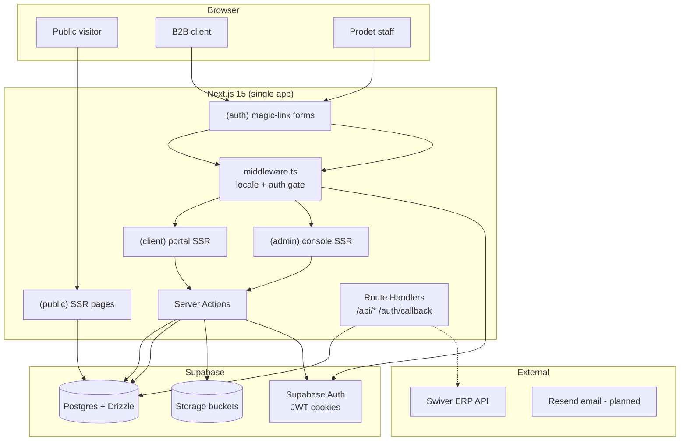
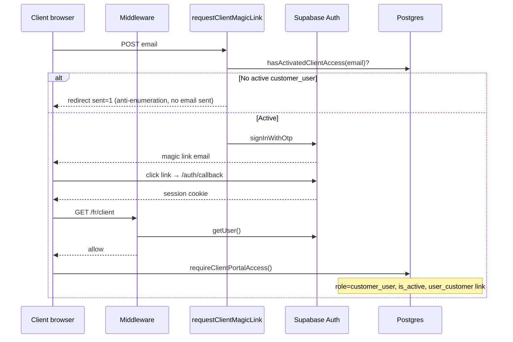
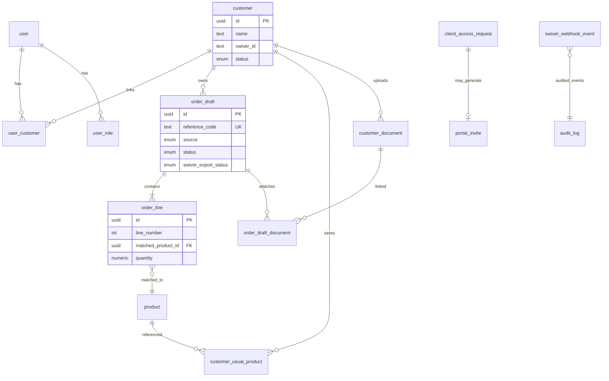
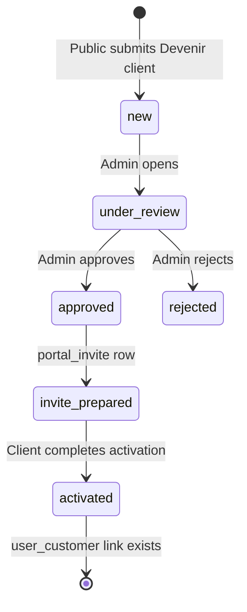
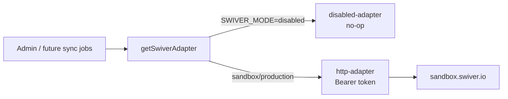

# Developer guide — Prodet Platform

> Audience: engineers onboarding to this repository.
> Last updated: 2026-06-06.
> **Claude Code:** start at [CLAUDE.md](../../CLAUDE.md) and [claude-code-handoff.md](../05-ops/claude-code-handoff.md).
> Companion docs: [system-overview.md](../02-architecture/system-overview.md), [tech-stack.md](../02-architecture/tech-stack.md), [data-model.md](../02-architecture/data-model.md), [auth.md](../02-architecture/auth.md), [project-status.md](../05-ops/project-status.md), [adr/](../02-architecture/adr/).

## 1. What this project is

**Prodet Platform** is a single Next.js application for Prodet Tunisie (B2B hygiene/cleaning products manufacturer). It serves three audiences from one codebase:

| Audience | Route group | Purpose |
|---|---|---|
| Public visitors | `(public)` | Marketing site, catalog, quote request, contact, legal |
| B2B clients | `(client)` | Authenticated portal: reorder, history, documents |
| Internal staff | `(admin)` | Access-request review, portal-request triage |

**Load-bearing principle:** *AI proposes. Humans approve. Swiver records.*

- No autonomous push to Swiver ERP.
- No public prices, stock, or payment.
- Every state change is auditable.

## 2. Tech stack (what we use and why)

| Layer | Choice | Why |
|---|---|---|
| Language | TypeScript strict | End-to-end types: Drizzle, Zod, RHF, server actions |
| Runtime | Node 20 LTS | Vercel default |
| Framework | Next.js 15 App Router | Server Components, server actions, one deploy for all surfaces |
| UI | Tailwind v4 + shadcn/ui | Velocity, full component ownership, accessible primitives |
| Forms | React Hook Form + Zod | Shared schemas client ↔ server ↔ AI output validation |
| i18n | next-intl | `[locale]` segment, SSR-friendly, RTL for Arabic |
| ORM | Drizzle | Lightweight, strong inference, no Prisma engine binary |
| Database | Postgres 15 (Supabase EU) | `pg_trgm`, `pgvector`, Auth + Storage bundled |
| Auth | Supabase Auth | Magic links, JWT in HTTP-only cookies |
| Storage | Supabase Storage | Private buckets + signed URLs for customer documents |
| Package manager | pnpm 9 | Fast, disk-efficient |
| Tests | Vitest + Playwright | Unit + E2E scaffold |
| Dev server | Turbopack (`pnpm dev -p 3004`) | Fast HMR |

**Explicitly avoided at MVP:** Prisma, GraphQL, Redux/Zustand, SWR/React Query, Pinecone/Algolia, separate microservices, custom auth, online payment.

See [tech-stack.md](../02-architecture/tech-stack.md) and [adr/](../02-architecture/adr/) for per-decision rationale.

## 3. Repository layout

```
src/
  app/
    [locale]/
      (public)/     # Marketing + catalog (no auth)
      (auth)/       # connexion-client, connexion-admin
      (client)/     # Portal (auth-gated)
      (admin)/      # Admin console (auth-gated)
    api/webhooks/   # External webhooks (Swiver)
    auth/callback/  # Supabase OAuth/magic-link callback
  components/       # UI (ui/ = shadcn copies, portal/ = portal shell)
  data/             # Static catalog fixtures (products, sectors, use-cases)
  db/
    schema/         # Drizzle table definitions
    client.ts       # Postgres connection (server-only)
  features/         # Domain logic + server actions
    client-portal/
    client-access/
    client-auth/
    admin/
    contact/
    quote/
  integrations/
    swiver/         # ERP adapter (disabled | sandbox | production)
  i18n/             # Locale routing + message loading
  lib/              # env, rate-limit, supabase helpers
  messages/         # fr (complete), ar/en (scaffolded)
drizzle/migrations/ # Forward-only SQL migrations
docs/               # Architecture, ADRs, module specs
scripts/            # Demo seed, portal screenshots
```

**Convention:** Route groups organize URLs; `features/` owns business logic; pages stay thin.

## 4. Architecture diagram



## 5. Routing and i18n

- **Locales:** `fr` (default, complete), `ar` (RTL), `en` (scaffolded).
- **Prefix:** always — `/fr/catalogue`, not `/catalogue`.
- **Middleware** (`src/middleware.ts`):
  - `/` → redirect to `/fr`
  - Paths without locale → prepend `/fr`
  - `/client/*` → require Supabase session (else redirect to `connexion-client`)
  - `/admin/*` → require Supabase session (else redirect to `connexion-admin`)
  - Sets `NEXT_LOCALE` cookie

### Route inventory

**Public:** `/`, `/catalogue`, `/catalogue/[slug]`, `/catalogue/categorie/[slug]`, `/secteurs`, `/secteurs/[slug]`, `/a-propos`, `/contact`, `/devis`, `/espace-client`, `/devenir-client`, `/activation-client`, legal pages.

**Auth:** `/connexion-client`, `/connexion-admin`, `/auth/callback`.

**Client portal:** `/client`, `/client/nouvelle-demande`, `/client/historique`, `/client/historique/[id]`, `/client/produits-habituels`, `/client/documents`.

**Admin:** `/admin/demandes-acces`, `/admin/demandes-acces/[id]`, `/admin/demandes-portail`, `/admin/demandes-portail/[id]`.

**API:** `POST /api/webhooks/swiver`.

## 6. Authentication and authorization

### Two-layer identity

1. **Supabase Auth** — session/JWT in HTTP-only cookies.
2. **`app_user` row** — business identity linked via `auth_id` or email.

### Client portal access chain



**`requireClientPortalAccess()`** (`src/features/client-portal/auth.ts`):

- Resolves `app_user` by `auth_id` or email (lazy link on first login).
- Requires `role === 'customer_user'` and `is_active`.
- Requires `user_customer` membership to a non-deleted `customer`.
- Throws typed errors consumed by pages/actions.

**Admin:** middleware checks session only at edge; server actions call `requireAdminAccess()` / `assertRole(...)` with service-role DB access.

### Security invariants

- Service-role key never in client bundles.
- Every mutation Zod-validated.
- Rate limits on login, contact, uploads.
- Anti-enumeration on client magic link.
- CSP + security headers in `next.config.ts`.
- Audit log rows on state-changing admin/portal actions.

## 7. Data model (implemented tables)



### Unified queue: `order_draft`

All order-like inputs converge here:

| `source` | Origin |
|---|---|
| `email` | Inbound email (planned) |
| `pdf` | Uploaded PDF (planned) |
| `phone` | Manual admin entry (planned) |
| `web_quote` | Public devis form |
| `portal` | Authenticated client portal |

| `status` | Meaning |
|---|---|
| `parsing` | Awaiting AI extraction |
| `review` | Awaiting Prodet review |
| `approved` | Human approved |
| `exported` | Copied/pushed to Swiver |
| `rejected` | Declined |

Portal requests use `source = 'portal'` and reuse `order_line` with `matched_product_id` set at submission time (no AI matching needed for catalog picks).

## 8. Key modules

### 8.1 Public catalog

- **Data source (MVP):** static TypeScript fixtures in `src/data/products.ts`, `sectors.ts`, `use-cases.ts` — not yet fully DB-backed for public pages.
- **Search algorithm:** client-side **token AND-match** over a pre-built haystack per product.

```
normalize(text):
  NFKD → strip diacritics → lowercase → non-alphanumeric → spaces

match(product, query):
  terms = normalize(query).split(' ')
  return terms.every(term => haystack.includes(term))

rank(product, query):
  +100 if name starts with first term
  +40  if slug contains first term
  +8 per term in full haystack
  +4 per term in name
  +6 per term in slug
```

Same logic in `src/data/queries.ts` (public catalog) and `src/lib/portal-product-search.ts` (portal request builder).

**Why not pg_trgm in the browser path yet:** catalog size is small (~50 products); in-memory search avoids round-trips. DB indexes (`product.search_text` GIN trgm) exist for future server-side admin/AI matching.

### 8.2 Client portal — request builder

Flow (`src/features/client-portal/request-builder.ts`):

1. `listPortalProductOptions(locale)` — DB join product + translation + category.
2. Client-side search/filter/rank via `portal-product-search.ts`.
3. `submitPortalRequest` — Zod validate lines, rate limit, `requireClientPortalAccess()`.
4. Insert `order_draft` (`source=portal`, `status=review`) + `order_line` rows.
5. Write `audit_log`, revalidate portal paths.
6. Reference code via `generateReferenceCode()` (`WEB-YYYY-NNNN` pattern).

**Recurrence** (`portal-recurrence.ts`): metadata stored in `raw_inbound` / internal notes — `once | weekly | every_14d | monthly | custom`. Human-readable labels for history UI only; no scheduler yet.

### 8.3 Client portal — dashboard analytics

`getClientDashboardData()` runs **parallel Drizzle queries** scoped to `customer_id + source=portal`:

| Metric | Algorithm |
|---|---|
| Status counts | `GROUP BY status` |
| Current month | `created_at >= startOfMonth` |
| Activity trend | Count last 90d vs prior 90d → `delta = last90 - previous90` |
| Cadence | Average days between last 8 request `created_at` timestamps |
| Top products | `SUM(quantity)` + `COUNT(DISTINCT order_draft_id)` over 90d, matched products only |
| Usual products | `customer_usual_product` join, preview top 5 |

No fake ERP data — empty states when insufficient history.

### 8.4 Client access onboarding



- `client_access_request` — public form intake.
- `portal_invite` — token hashed SHA-256 (`invite-token.ts`), 7-day TTL.
- Activation page binds Supabase user to `app_user` + `user_customer`.

### 8.5 Customer documents

- Tables: `customer_document`, `order_draft_document` (many-to-many attach).
- Storage path: `customer-documents/<customer_id>/<doc_id>/<filename>`.
- Upload via server action → service-role Supabase Storage → metadata row.
- Download via short-lived signed URL (never expose bucket publicly).
- MIME allow-list + 25 MB cap + rate limits.

### 8.6 Swiver integration (architecture shipped, live sync gated)

Adapter pattern (`src/integrations/swiver/`):



| `SWIVER_MODE` | Behavior |
|---|---|
| `disabled` (default) | Empty reads, safe degradation |
| `sandbox` | HTTP adapter to sandbox base URL |
| `production` | HTTP adapter to prod base URL |

Webhook `POST /api/webhooks/swiver`:

- Always persists `swiver_webhook_event` first (audit trail).
- Returns 200 quickly; dedupes by `event_id`.
- Signature verification **mocked in dev** — must be hardened before production exposure.

**Sync rule (ADR 0012):** Swiver wins on master data; Prodet owns portal drafts, aliases, and customer uploads; human approves before any write to Swiver.

## 9. Algorithms and complexity notes

| Area | Approach | Complexity | Notes |
|---|---|---|---|
| Product search (public + portal) | Normalized token AND-match + weighted rank | O(n × t) per keystroke, n ≈ 50 products | Fine at MVP scale |
| Dashboard aggregates | SQL `GROUP BY`, `SUM`, window counts | O(requests) per customer, indexed | Parallel `Promise.all` |
| Rate limiting | In-process sliding window `Map` | O(1) amortized per request | **Not multi-instance safe** — swap to Redis/Upstash when scaled |
| Invite tokens | `randomBytes(32)` + SHA-256 hash at rest | O(1) | Plain token only in email URL once |
| Auth anti-enumeration | Same `sent=1` UX whether email exists | O(1) DB lookup | Security UX tradeoff |
| Future AI matching | alias → code → pg_trgm → pgvector → LLM rerank | Designed, not all wired in portal path | See ADR 0008 |

## 10. Server actions vs route handlers

| Use server actions | Use route handlers |
|---|---|
| Form mutations from UI | Webhooks (Swiver, future Postmark) |
| Portal submit, document upload | OAuth callback (`/auth/callback`) |
| Admin review decisions | External systems without RSC context |

All server action files start with `'use server'`. DB client imports are dynamic where needed to avoid loading `DATABASE_URL` on public pages.

## 11. Environment variables

Validated via Zod in `src/lib/env.ts`:

| Variable | Required for | Notes |
|---|---|---|
| `DATABASE_URL` | DB features | Server-only |
| `SUPABASE_URL`, `SUPABASE_ANON_KEY` | Auth middleware | Anon key is public-safe |
| `SUPABASE_SERVICE_ROLE_KEY` | Admin actions, storage | Never client-side |
| `SUPABASE_CUSTOMER_DOCUMENTS_BUCKET` | Documents module | Default `customer-documents` |
| `NEXT_PUBLIC_SITE_URL` | Magic link redirects | Default `http://localhost:3004` |
| `SWIVER_MODE` | ERP adapter | `disabled` \| `sandbox` \| `production` |
| `SWIVER_API_BASE_URL`, `SWIVER_API_KEY` | Live Swiver reads | Optional until sandbox testing |
| `SWIVER_WEBHOOK_SECRET` | Webhook verification | Optional in dev |

Copy `.env.example` → `.env.local` for local dev.

## 12. Local development

```bash
pnpm install
pnpm db:migrate          # apply Drizzle migrations
pnpm db:seed:demo-portal # optional portal demo data
pnpm dev                 # http://localhost:3004
pnpm typecheck && pnpm lint && pnpm test && pnpm build
```

**Demo portal seed:** `scripts/seed-demo-portal.sql` — requires an existing `customer_user` email in DB.

**Screenshots:** `pnpm screenshots:portal` — Playwright-based portal captures.

## 13. Testing

| Suite | Tool | Coverage today |
|---|---|---|
| Unit | Vitest | i18n routing, contact/quote schemas, catalog search, utils |
| E2E | Playwright | Scaffolded (`pnpm test:e2e`) |

Run `pnpm test` before declaring work done.

## 14. Migrations

- Location: `drizzle/migrations/`
- Forward-only — never edit applied migrations.
- Generate: `pnpm db:generate` after schema change in `src/db/schema/`.
- Apply: `pnpm db:migrate`

Recent portal-related migrations:

- `0003`–`0005` — client access, portal tables
- `0006` — customer documents
- `0007` — swiver webhook events

## 15. What is built vs planned

| Built (in code today) | Planned / gated |
|---|---|
| Public site + catalog (fixture data) | Full DB-backed public catalog |
| Client portal (dashboard, requests, history, usual products, documents) | Swiver document mirror in portal |
| Admin: access requests + portal request review | Full order intake console (AI extraction) |
| Swiver adapter + webhook receiver (disabled by default) | Live sync, real webhook HMAC |
| Magic-link auth (client + admin) | 2FA for owner role |
| Rate limiting (in-process) | Redis-backed rate limits |
| FR copy complete; AR/EN scaffolded | Progressive AR/EN translation |
| Static product data + client-side search | pg_trgm/pgvector matching pipeline |
| Audit log on mutations | Inngest background jobs |

## 16. Design decisions worth knowing

1. **One app, not three** — shared types, one deploy, solo-dev velocity ([ADR 0002](../02-architecture/adr/0002-nextjs-app-router.md)).
2. **order_draft as universal queue** — portal requests are not a separate table ([ADR 0011](../02-architecture/adr/0011-client-portal-access-and-request-model.md)).
3. **No open registration** — request access → admin approve → invite ([auth.md](../02-architecture/auth.md)).
4. **Server Components by default** — `'use client'` only for interactive islands (request builder, forms, nav).
5. **Zod everywhere** — forms, env, webhook payloads, AI output (when wired).
6. **Graceful degradation** — Swiver disabled mode, storage unavailable errors, rate limit messages in FR.
7. **RTL-safe CSS** — Tailwind logical properties (`ms-*`, `ps-*`), not `ml-*`/`mr-*`.

## 17. Further reading

| Topic | Doc |
|---|---|
| Vision / MVP scope | [vision.md](vision.md), [mvp-scope.md](../01-product/mvp-scope.md) |
| Module specs | [client-portal.md](../03-modules/client-portal.md) |
| Swiver adapter README | `src/integrations/swiver/README.md` |
| First admin setup | [first-admin-setup.md](../05-ops/first-admin-setup.md) |
| All ADRs | [adr/README.md](../02-architecture/adr/README.md) |
