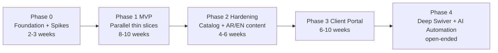

# Roadmap — Prodet Platform

> Status: Draft. Owner: Souhail. Last updated: 2026-05.
> Companion docs: [mvp-scope.md](mvp-scope.md), [non-goals.md](non-goals.md), [prd.md](prd.md), [backlog.md](backlog.md), [open-questions.md](open-questions.md).

## Visual phasing

Time estimates assume Souhail at the cadence implied by [open question 12](open-questions.md). They are **rough** and subject to spike outcomes. Calendar weeks, not engineering weeks.

---

## Phase 0 — Foundation and spikes (2–3 weeks)

**Goal.** Retire the technical risks before bulk build. Decide architecture. Stand up the repository.

### Workstreams

- **Spikes** ([06-spikes/](../06-spikes/)) — six in total. The first three (Swiver API, AI extraction, product matching) are gating; the others can start in parallel.
- **Repository setup.** Already done in conception phase: docs tree, ADR scaffold, Cursor rules, CI placeholders.
- **Architecture finalization.** Convert ADR stubs ([0002-0010](../02-architecture/adr/)) into accepted decisions based on spike results.
- **Design tokens and brand.** Tailwind config, font choices including AR (Spike 6), color palette, base components.
- **Hosting + region decision.** EU vs MENA-resident, with data-residency considerations ([open question 8](open-questions.md)).
- **Brand assets gathering.** Logo, photos of factory, product photography plan ([open questions 4, 5](open-questions.md)).

### Exit criteria (Phase 0 → Phase 1)

- Spikes 1, 2, 3 each have a written result + decision (gate met or workaround documented).
- Each ADR 0002–0010 is in `accepted` or `superseded` state — no `proposed` left blocking development.
- Open questions 1–5, 7, 8, 10, 12 ([open-questions.md](open-questions.md)) have answers.
- A baseline Postgres database exists with schema migrated to `data-model.md` v1.
- A Next.js scaffold exists in `apps/web/` (or root) with the i18n + RTL skeleton working on a "hello world" page.
- CI is green: lint, typecheck, build.

If exit criteria are not met by week 4 → re-scope. Dropping Slice B from MVP is the most likely move.

---

## Phase 1 — MVP, parallel thin slices (8–10 weeks)

**Goal.** Ship a credible public B2B website **and** a usable internal order intake console, simultaneously, to production.

### Slice A: Public B2B website

Scope: see [mvp-scope.md §Slice A](mvp-scope.md#in-scope--slice-a-public-b2b-website).

Sub-milestones (in order):

1. **Layout + i18n shell** (week 1). Header, footer, language switcher, RTL working.
2. **Static pages** (weeks 2–3). Homepage, About, Contact, Sectors index (single page), legal pages.
3. **Catalog read path** (weeks 3–4). Product list, filters, product detail. Seeded with audited manufactured products (~30–50 to start).
4. **Quote-request form** (week 5). Multi-line form. Honeypot + Turnstile. Backend handler creates an order draft.
5. **SEO + perf pass** (week 6). Sitemap, robots, meta, JSON-LD, Lighthouse cleanup.
6. **AR + EN content pass** (weeks 6–8 in parallel). FR-complete + AR/EN scaffolded; key pages translated.
7. **Launch checklist** (week 8). DNS cutover, analytics, RGPD review, smoke tests.

### Slice B: Internal order intake console

Scope: see [mvp-scope.md §Slice B](mvp-scope.md#in-scope--slice-b-internal-order-intake-console).

Sub-milestones (in order):

1. **Auth + admin shell** (week 1). Supabase Auth, admin route group, layout.
2. **Customer + product directories** (weeks 2–3). Read-only mirrors from Swiver CSV import.
3. **Manual entry path** (week 3). The first usable workflow — typed-in phone orders. Even without AI, this should be faster than Swiver-direct for repeat customers because of customer-context awareness.
4. **AI extraction integration** (weeks 4–5). Wire up the extraction service + Zod schema. Single-input flow (paste or upload PDF).
5. **Product matching + review UI** (weeks 5–7). The keyboard-first review screen. Aliases on save.
6. **Push to Swiver path** (week 7). Either API push (if Spike 1 passed) or print-friendly copy view.
7. **Quote-request bridge** (week 8). Public quote form lands here. Same UI.
8. **Adoption checklist with Mère and Sœur** (weeks 8–9). Stopwatch test on 5 real orders. Iterate.

### Cadence

- Weekly demo Friday EOD. Both slices show progress.
- Each slice has a "this-week scope" frozen Monday. New ideas → backlog, not the current week.
- Bug-fix Friday: half a day reserved for triage of issues from the previous week's demo.

### Exit criteria (Phase 1 → live MVP)

All A1–A10 acceptance criteria from [mvp-scope.md](mvp-scope.md#acceptance-criteria-high-level) met.

Particular attention to:

- **A7** (matching ≥ 80% top-1 on holdout after 150 alias seeds).
- **A8** (Mère's stopwatch test: ≤ 50% of current Swiver-only time on 5 real orders).

If A7 or A8 fails → Phase 1 is not done. See tripwires below.

### Tripwires (Phase 1)

These are **kill-switches**, not warnings. Hitting any of them triggers a re-scope conversation, not an "extend the deadline" conversation.

- **Tripwire 1: parallel slip.** Two consecutive weekly demos in which either Slice A or Slice B has zero shippable progress → collapse to single-slice mode. Slice A first (lower risk, more visible). Slice B becomes Phase 2.
- **Tripwire 2: extraction failure.** Spike 2 result < 60% top-1 line precision on real Prodet emails → reframe Slice B as a "structured form for paste-and-correct" with no LLM in the critical path. Defer LLM extraction to Phase 2.
- **Tripwire 3: matching failure.** Spike 3 result < 50% top-1 with 150 aliases seeded → reframe matching as "search-and-pick" rather than "auto-match-and-confirm." Defer the auto-match UX to Phase 2.
- **Tripwire 4: Swiver opaque.** Spike 1 shows no API and no usable bulk-export → escalate to Père. Reconsider whether the long-term plan is to coexist with Swiver or replace it. Slice B v1 ships with the manual copy/paste path either way; the conversation is about Phase 4.
- **Tripwire 5: AR content blocks Slice A.** AR translation/RTL pass takes more than 2 cumulative weeks → ship FR-complete + AR/EN behind a "language coming soon" notice. Architecture stays multilingual; only public content waits.
- **Tripwire 6: Mère adoption.** A8 fails twice in iteration → suspend the launch. Schedule a working session with Mère to redesign the review UI from her keyboard-mapping outward. Mère's adoption is *the* operational thesis.

---

## Phase 2 — Hardening and catalog/content expansion (4–6 weeks)

**Goal.** Take the MVP from "works for the family" to "earns its keep daily and looks complete to outsiders."

### Workstreams

- **Catalog expansion.** Add the ~233 *articles commercialisés* progressively. Audit each for image, description, sector tags. Visibility off until ready.
- **AR + EN content completion.** Translate all marketing pages, sector index, product short descriptions. Glossary-anchored. Deep product descriptions may stay FR-only if cost-prohibitive.
- **Sector deep pages.** One page per sector key from [sectors.md](../00-overview/sectors.md). Curated product lists, use cases, optional sector-specific guidance.
- **Fiche technique / SDS hosting.** Upload existing PDFs ([open question 6](open-questions.md)). Searchable index. Per-locale fallback if a translated SDS does not exist.
- **Search.** Postgres FTS with `unaccent` + French dictionary + Arabic config (or third-party if FTS proves limiting). Search bar on catalog and product pages.
- **Telemetry.** Track extraction accuracy over time, match override rate, time-to-validate, push-to-Swiver volume. Père dashboard adds these.
- **Image quality pass.** Real product photography for the top 30 products if budget allows.
- **Auto-acknowledge to clients on order receipt** (if [open question 13](open-questions.md) resolves to yes).
- **Backlog grooming.** Promote items from MVP feedback.

### Exit criteria

- Public catalog ≥ 200 visible products (manufactured + selected resold).
- AR and EN navigation + key pages translated end-to-end.
- All 7 sector deep pages live.
- Match override rate < 30% over the previous 30 days (a leading indicator that aliases are stabilizing).

---

## Phase 3 — Client portal (6–10 weeks)

**Goal.** Give the subset of digitally-comfortable clients a self-service repeat-order experience.

### Workstreams

- **Customer auth.** Self-serve signup gated by an admin approval (no anonymous portal accounts). Password + magic link.
- **Account model.** A customer organization can have multiple users.
- **Repeat order.** "Reorder last month" landing page. Adjust quantities. Submit → lands in the same review queue (with a `source = portal` marker).
- **Order history.** Lists past orders sourced from internal records and from Swiver export, deduplicated.
- **Customer-scoped aliases.** Visible to the customer. Editable with admin approval.
- **Optional client-specific pricing.** Only if [open question 14 (long-term Swiver posture)](open-questions.md) and Swiver capability allow. Otherwise: prices remain offline at this phase too.
- **Quote-to-order conversion.** A devis approved by Père becomes a "ready to confirm" item in the customer portal.

### Exit criteria

- ≥ 5 real customers actively using the portal monthly.
- Portal-sourced orders processed in the same console workflow as email-sourced orders, no special-case code paths.
- Customer-scoped aliases editable by customers without breaking matching.

---

## Phase 4 — Deep Swiver integration + AI automation (open-ended)

**Goal.** Move from "AI proposes, humans approve" to "AI proposes, humans approve, then watches AI do it." Automate the boring parts that the family has explicitly approved.

### Candidate workstreams (priority TBD)

- **Direct Swiver write.** Push approved drafts as devis or bons de commande via Swiver API.
- **WhatsApp Business API.** Replace `wa.me` deep links with a real conversational pipeline: order received → auto-reply with summary → customer confirms → draft created.
- **Sales insights dashboard.** Pull Swiver exports nightly. Trend revenue, top customers, slow movers, customer dormancy alerts.
- **CRM-lite follow-up suggestions.** "Customer X has not ordered in 60 days. Their usual list is..." → suggested WhatsApp template.
- **Auto-push for high-confidence orders.** Per-customer opt-in. Confidence threshold. Shadow run + rollback.
- **Stock sync — but only when stock is reliable.** Requires the workers to update stock movements (Phase 4 driver app or manual discipline).
- **Driver / delivery confirmation app.** Mobile-only, barebones. Confirm delivery, capture signature, trigger stock movement and BL generation.
- **Procurement / supplier module.** Mirror of order intake, pointed at suppliers instead of customers.

### Exit criteria

There is no exit. Phase 4 is a portfolio of independent workstreams. Each one ships when its individual acceptance criteria are met. Each one needs its own ADR.

---

## Tripwires (cross-phase summary)

Restated for visibility — full text in §Phase 1.

1. **Parallel slip** → collapse to single-slice mode.
2. **Extraction < 60% top-1** → defer LLM extraction.
3. **Matching < 50% top-1** → reframe as search-and-pick.
4. **No Swiver API** → defer auto-push to Phase 4.
5. **AR blocks Slice A** → ship FR-complete with AR/EN coming-soon.
6. **Mère adoption < 50%** → suspend launch, redesign review UI.

## Cadence rituals

- **Monday.** Plan the week's slice scope. Update todos. Triage incoming bugs.
- **Friday.** Demo. Stopwatch test (when applicable). Update [backlog.md](backlog.md) with discoveries.
- **Monthly.** Read each phase's exit criteria. Confirm or revise. Re-litigate one tripwire.

## Related

- [mvp-scope.md](mvp-scope.md), [non-goals.md](non-goals.md), [prd.md](prd.md), [backlog.md](backlog.md), [open-questions.md](open-questions.md).
- [../06-spikes/](../06-spikes/) — gating spikes for Phase 0.
- [../02-architecture/adr/](../02-architecture/adr/) — architectural commitments.
