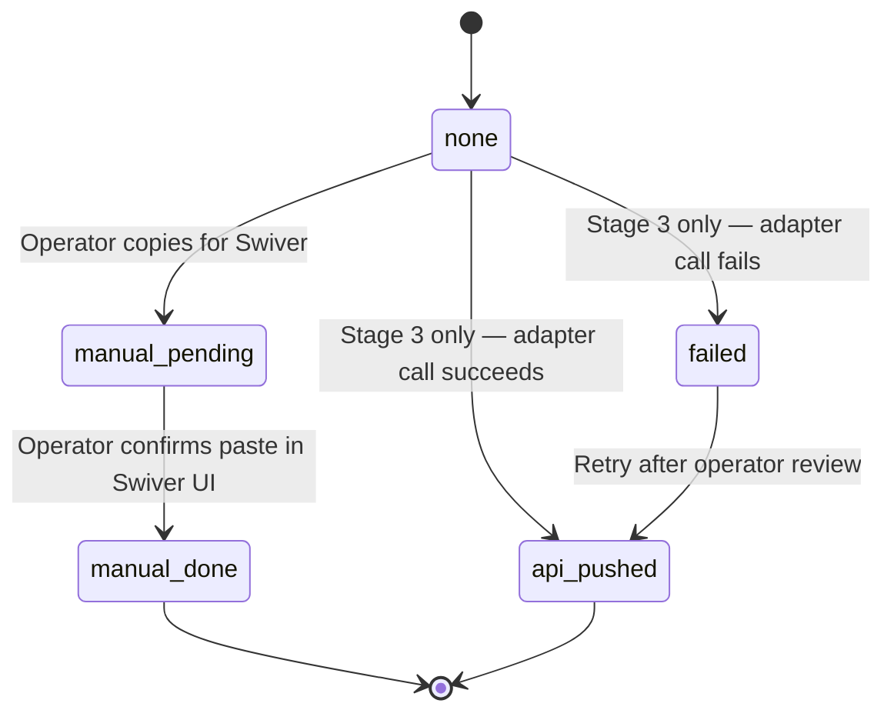

# ADR 0012 — Swiver integration architecture (adapter, sync boundaries, prerequisites)

- **Status.** Proposed (gated on credentials + sandbox access from Souhail)
- **Date.** 2026-05-18
- **Owner.** Souhail
- **Supersedes.** Extends [ADR 0009](0009-swiver-integration-strategy.md) with the concrete adapter contract, sync boundaries, and the prerequisites required to move past Stage 1.

## Context

Swiver (TN-hosted ERP) is the system of record for accounting, official commercial documents (devis, BC, BL, facture) and master data (customers, products). Prodet Platform is the operational front-office:

- Internal admins use it to triage extracted orders and approve drafts before they enter Swiver.
- Client-portal users see their portal requests, top products, and (Phase 3) shared documents.

Swiver publishes a public API ([docs.swiver.io/api](https://docs.swiver.io/api/)). The user has access to a sandbox tenant at `sandbox.swiver.io` and can create an "Application web" integration entry yielding an API token. The documented endpoint families currently cover: Customers, Documents, Products, Suppliers, Brands, Categories, Taxes, VATs, Warehouses, Units, Payments.

This ADR defines:

1. The TypeScript adapter contract used by every Prodet Platform feature that needs to read or write Swiver — so live integration can be added later in one place.
2. The sync boundaries (what flows which way, when, and what is authoritative).
3. The document-ingestion workflow that connects Prodet Platform documents/portal requests to Swiver records.
4. The status synchronisation strategy for order_draft ↔ Swiver document.
5. The future invoice synchronisation strategy (read-only ingest into the portal).
6. The explicit prerequisites required before any live API call is wired.

## Decision

### 1. Single adapter, replaceable transport

All Swiver access goes through `src/integrations/swiver/`. The package exposes a single `SwiverAdapter` interface (defined below). Features call the adapter; they never import an HTTP client. This keeps:

- Mocking trivial in tests.
- The sandbox→production swap a configuration change.
- Future replacement (e.g., a CSV-export fallback if the API contract changes) a one-implementation switch.

```ts
export interface SwiverAdapter {
  customers: SwiverCustomerPort;
  products:  SwiverProductPort;
  documents: SwiverDocumentPort;
  health:    SwiverHealthPort;
}
```

Ports are scoped intentionally. New verbs (e.g. payments, balances) require ADR addenda — we do not "add fields just in case".

### 2. Sync boundaries (authoritative ownership)

| Entity                        | Authoritative in        | Direction       | Sync mode                        |
|-------------------------------|-------------------------|-----------------|-----------------------------------|
| Customer master data          | Swiver                  | Swiver → Prodet | Daily pull + on-demand refresh   |
| Product master data           | Swiver                  | Swiver → Prodet | Daily pull + on-demand refresh   |
| Product aliases / synonyms    | Prodet Platform         | Prodet only     | Never sent to Swiver             |
| Order drafts                  | Prodet Platform         | Prodet only     | Reviewed locally before push     |
| Devis (quote document)        | Swiver                  | Prodet → Swiver | Operator triggers push (Stage 3) |
| Bon de commande               | Swiver                  | Prodet → Swiver | Operator triggers push (Stage 3) |
| Facture                       | Swiver                  | Swiver → Prodet | Read-only ingest for portal      |
| Customer balances / payments  | Swiver                  | Swiver → Prodet | Read-only ingest, on-demand      |
| Customer-uploaded documents   | Prodet Platform Storage | Prodet only     | Never sent to Swiver             |

Rules:

- **Swiver wins on conflict** for any field it owns. Prodet stores `swiver_id`, `swiver_document_ref` and `swiver_export_status`; on conflict we surface a review row, never auto-overwrite Swiver.
- **Prodet is the system of record for portal artefacts.** Order drafts, aliases, and client-uploaded documents stay in our DB even after the corresponding Swiver record exists.
- **One direction at a time, ever.** Bidirectional real-time sync is out of scope. Each entity has exactly one push direction.

### 3. Document-ingestion workflow

There are three distinct artefact streams:

1. **Inbound order documents** (emails, PDFs) → already modelled as `order_attachment`. No change.
2. **Client-uploaded documents** (BC PDFs, ERP exports, spreadsheets) → modelled in `customer_document` + `order_draft_document` (added in migration `0006_hesitant_jackal`). These never leave Prodet Storage. They are not pushed to Swiver because Swiver's `Documents` API is for ERP records, not free-form attachments.
3. **Swiver documents** (devis/BC/BL/facture) → read-only ingest. When Stage 2 enables, the `SwiverDocumentPort` fetches documents by `customer_id` and stores normalised summaries in a new table (out of scope of this ADR; the column shape is sketched below).

For Stage 1 (today) we ship only #1 and #2. #3 starts when sandbox credentials and a confirmed customer-mapping rule arrive.

### 4. Status synchronisation strategy

`order_draft.swiver_export_status` is already in the schema with values `none | manual_pending | manual_done | api_pushed | failed`. The state machine:



When `api_pushed`, `swiver_document_ref` carries the document id returned by Swiver. A read sync (Stage 2) can then update a separate `swiver_status` column (proposed for a follow-up migration) without touching `swiver_export_status` — the latter records *our* action, the former mirrors *Swiver's* truth.

### 5. Future invoice synchronisation strategy

Invoices are the most user-facing Swiver artefact. Plan:

- Read-only mirror: a `customer_invoice` projection table (id, customer_id, swiver_document_ref, document_number, issue_date, total_ttc, due_date, status, currency).
- Ingested by a daily Inngest job and on-demand refresh from an admin "Resync" button.
- Surfaced in the client portal under "Facturation" with PDF download (signed URL or Swiver hosted URL — TBD per Swiver capability).
- Never editable in Prodet Platform.

This deliberately stays as a sketch; the projection table will get its own ADR + migration once the Swiver `Documents` endpoint shapes are confirmed for the sandbox tenant.

### 6. Connection identity model

Swiver multi-tenant API: each Prodet sandbox/prod tenant uses a *single* integration token, scoped at the Swiver org level. Prodet stores that token server-side only in env (`SWIVER_API_KEY`, Bearer auth). Per-customer scoping happens at *our* layer — we always pass `customer.swiver_id` to scope reads.

Webhooks: Swiver's integration panel exposes a webhook URL toggle. The Prodet receiver lives at `POST /api/webhooks/swiver`. The route durably persists every event in `swiver_webhook_event`. Until Swiver documents its signing algorithm and the sandbox is reliably online for interception testing, verification is **mocked**: rows are stored with `signature_verified = true` and `error = 'signature_verification_mocked_development_only'` so audits can distinguish pre-crypto era payloads. The handler carries an explicit `TODO` to replace this with timing-safe HMAC verification keyed by `SWIVER_WEBHOOK_SECRET`. A background job (out of scope of this ADR) walks `status = 'received'` rows. Webhook payloads are not used to drive business state yet — audit + future wiring only.

## Alternatives considered

- **In-line HTTP calls scattered through features.** Rejected: makes mocking + swapping painful, and we already paid the conceptual cost of the adapter pattern elsewhere (Supabase, rate limiter).
- **Mirror everything Swiver exposes.** Rejected: invitation to drift. We only project what the portal/admin actually renders.
- **Push aliases up to Swiver.** Rejected: aliases are noisy, customer-specific, and would clutter Swiver master data. They belong in Prodet.
- **Bidirectional realtime via webhooks.** Deferred to Phase 4 (Stage 3) at the earliest; complexity not justified at MVP.

## Consequences

- **Positive.**
  - Every Swiver call has a single home; mocking and tests are straightforward.
  - The portal can ship documents (Phase 3) without depending on Swiver wiring.
  - Status drift between Prodet and Swiver is bounded and observable.
- **Negative.**
  - Adapter is YAGNI-adjacent today: shipping it adds files even before live calls happen. We accept this because retro-fitting an adapter after features have already imported an HTTP client is harder than starting clean.
  - Read-only invoice mirror adds another sync surface to babysit once enabled.
- **Neutral.**
  - Aligns with [ADR 0009](0009-swiver-integration-strategy.md) — does not change its staging, only fleshes out Stages 2 and 3.

## Prerequisites required from Souhail before flipping `SWIVER_MODE` away from `disabled`

Confirmed as of 2026-05-18:

| Item                                                     | Status                                                   |
| -------------------------------------------------------- | --------------------------------------------------------- |
| Swiver API token (sandbox) — Bearer auth                 | **Provided** — saved as `SWIVER_API_KEY` in `.env`.       |
| Webhook capability                                       | **Confirmed available** in Swiver dashboard.              |
| Webhook URL on Prodet side                               | **Live** at `${NEXT_PUBLIC_SITE_URL}/api/webhooks/swiver`. |
| Persistence + idempotency for incoming webhooks          | **Built** via `swiver_webhook_event` table.               |
| Customers list endpoint shape                            | **Confirmed** — `GET /open_api/customers/`, paginated.    |

Still required to flip the adapter to `sandbox`:

1. **Sandbox base URL** — exact value to set as `SWIVER_API_BASE_URL`. The screenshot shows the docs URL pattern `https://server.{tenant}/open_api/`; confirm whether it is `https://sandbox.swiver.io`, `https://api.swiver.io`, or a per-org subdomain. (Without this, the HTTP adapter cannot make a call.)
2. **Webhook signature scheme** — header name + algorithm once sandbox returns; replace the mocked verifier in `/api/webhooks/swiver`.
3. **`SWIVER_WEBHOOK_SECRET`** — populate when signing is implemented (currently unused during mock phase).
4. **Document-list endpoint shape** — exact path (`/open_api/documents/?customer=...`?), supported filters, and the `state`/`status` enum values. Required for read-only invoice mirror.
5. **Document type enum** — which `type` value corresponds to *devis*, *bon de commande*, *bon de livraison*, *facture*, *avoir*. Required for the document mapper.
6. **`customer.swiver_id` mapping** — confirm the integer customer id returned by `GET /open_api/customers/` is what Swiver expects when scoping the documents endpoint by customer.
7. **Products endpoint shape** — required for product sync (optional at Stage 2; can be deferred).
8. **Rate-limit posture** — documented or observed. Drives the pull cadence of the background job and the timeout config on the HTTP transport (currently 10 s default).
9. **Production base URL + API key** — only after sandbox is validated end-to-end.
10. **Legal / RGPD review** — before mirroring invoices into Prodet Storage, confirm that the customer-facing T&Cs permit it.

Once items 1–3 land, `SWIVER_MODE=sandbox` becomes safe to enable. Items 4–6 unblock the documents/invoices sync stage.

## References

- [Swiver API root](https://docs.swiver.io/api/)
- [ADR 0009](0009-swiver-integration-strategy.md) — Swiver coexistence strategy
- [`src/integrations/swiver/`](../../../src/integrations/swiver/) — adapter scaffold
- [Spike 1](../../06-spikes/spike-swiver-api.md) — Swiver API discovery
