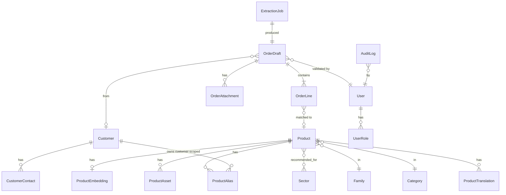
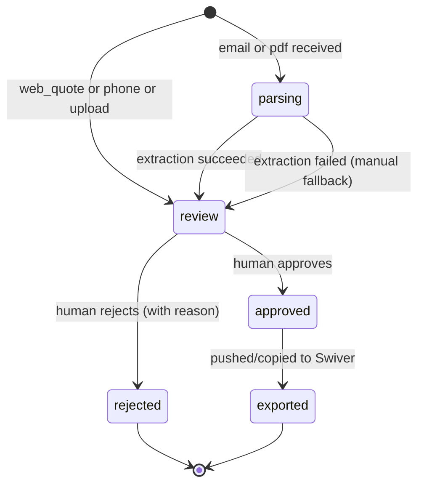
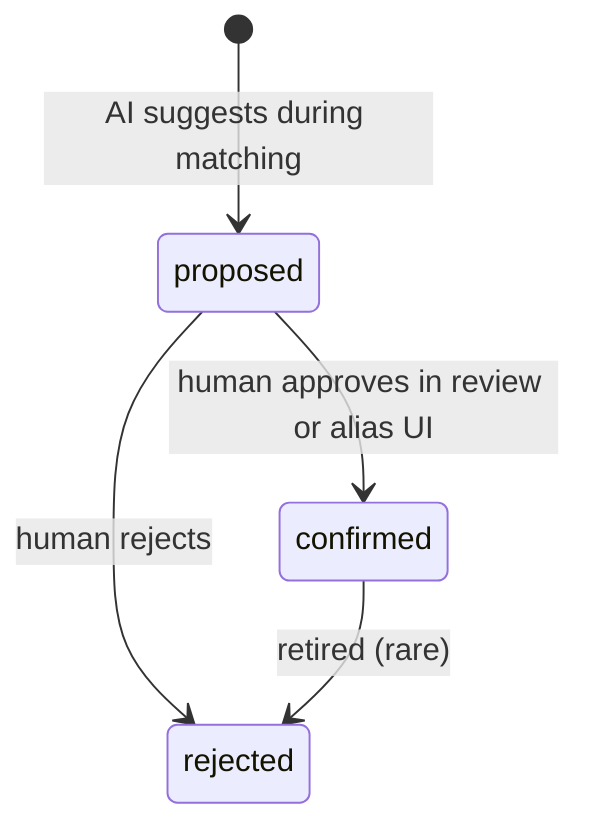

# Data model — Prodet Platform

> Status: Draft. Owner: Souhail. Last updated: 2026-05.
> Naming: `snake_case` for tables and columns. Singular table names (`product`, `order_draft`).

## Diagram

## Entities (high-level)

### `product`

The official Prodet/Swiver product. Source of truth for canonical names, codes, packaging.

Important columns (illustrative — not the migration):

- `id` (uuid, pk)
- `swiver_id` (text, unique nullable) — the Swiver internal ID once known
- `code` (text, unique) — official SKU / référence
- `name_canonical` (text) — primary FR name as it appears in Swiver
- `slug` (text, unique) — URL-safe key
- `category_id` (fk → category)
- `family_id` (fk → family, nullable)
- `is_manufactured_by_prodet` (bool) — drives "fabriqué chez nous" badges
- `is_visible_public` (bool) — controls public catalog inclusion
- `conditionnement` (text) — e.g. "BIDON 5 KG"
- `unit_of_sale` (text) — `piece` | `litre` | `kg` | `carton` | …
- `search_text` (text, generated) — lowercased + unaccented concat used by `pg_trgm`
- `notes_internal` (text)
- `created_at`, `updated_at`

Indexes: `code`, `slug`, GIN on `search_text` (`gin_trgm_ops`), tsvector on `search_text`.

### `product_translation`

Per-locale name and descriptions. FR row is required.

- `(product_id, locale)` — composite key
- `name` (text)
- `short_description` (text)
- `long_description` (text)

Locales: `fr`, `ar`, `en`. AR/EN may be missing → fallback chain `request locale → fr`.

### `product_alias`

The heart of the matching engine. Captures every non-canonical string a customer or staff member uses to refer to a product.

- `id` (uuid, pk)
- `product_id` (fk → product)
- `alias_text` (text) — the literal string ("javel 5L", "JAV 5", "notre détergent vert")
- `alias_text_normalized` (text, generated) — lowercased + unaccented + trimmed; this is what the matcher hits
- `scope` — `global` | `customer`
- `customer_id` (fk → customer, required iff `scope='customer'`)
- `validation_status` — `proposed` | `confirmed` | `rejected`
- `confidence` (numeric 0–1) — initial AI confidence
- `created_by` (fk → user, nullable — null if AI-proposed)
- `validated_by` (fk → user, nullable)
- `source_order_draft_id` (fk → order_draft, nullable) — provenance
- `created_at`, `validated_at`

Indexes: `alias_text_normalized` (btree + trigram), `(scope, customer_id)`.

Constraint: an alias can be `confirmed` only if `validated_by` is set and not the same as `created_by` if `created_by != null` — but this is a soft rule for now (we may waive in solo-dev workflow).

### `product_asset`

Files attached to a product (image, fiche technique, SDS).

- `id`, `product_id`
- `kind` — `image` | `fiche_technique` | `sds` | `other`
- `locale` (nullable — null = locale-agnostic, e.g. an image)
- `storage_path` (text)
- `mime_type`, `byte_size`
- `display_order` (int)
- `created_at`

### `product_embedding`

Per-product embedding for vector matching. Re-computed when `name_canonical` or active translations change.

- `product_id` (pk, fk → product)
- `model` (text) — e.g. `text-embedding-3-small`
- `dimensions` (int)
- `vector` (vector — `pgvector`)
- `source_text_hash` (text) — to detect when re-embedding is required
- `updated_at`

Index: `vector` with `vector_cosine_ops` (HNSW or IVFFlat).

### `category`, `family`, `sector`

Static taxonomy.

- `category` — `(id, key, name_fr, name_ar, name_en, display_order)`
- `family` — same shape, `category_id` fk
- `sector` — `(id, key, name_fr, name_ar, name_en, description_fr, description_ar, description_en, display_order, is_active)`
- `product_sector` — `(product_id, sector_id)` join

### `customer`

Mirror of Swiver customers. One-time CSV import at MVP; scheduled sync if API allows (Phase 4).

- `id` (uuid)
- `swiver_id` (text, unique nullable)
- `name` (text) — company name
- `display_name` (text, nullable)
- `email` (text, nullable)
- `phone` (text, nullable)
- `whatsapp` (text, nullable)
- `address_line1`, `address_line2`, `city`, `postal_code`, `country` — text
- `default_locale` — `fr` | `ar` | `en` (default `fr`)
- `sector_key` (text, nullable) — soft tag, not a fk
- `status` — `active` | `inactive` | `prospect`
- `tags` (text[])
- `notes_internal` (text)
- `created_at`, `updated_at`

### `customer_contact`

People at a customer organization (Phase 3 portal users live here too via fk to user).

- `id`, `customer_id`, `name`, `role`, `email`, `phone`, `whatsapp`, `is_primary`

### `order_draft`

The unifying entity. Every interaction that may produce a Swiver document goes through this.

- `id` (uuid)
- `reference` (text, unique) — short human ID like `PD-2026-00042`
- `source` — `email` | `pdf` | `phone` | `web_quote` | `portal`
- `customer_id` (fk → customer, nullable for unknown senders)
- `customer_proposed_text` (text, nullable) — raw "From" / contact line if customer not yet matched
- `status` — `parsing` | `review` | `approved` | `exported` | `rejected`
- `raw_input` (jsonb) — original email body / paste / form payload
- `notes` (text)
- `swiver_export_status` — `none` | `manual_pending` | `manual_done` | `api_pushed` | `failed`
- `swiver_document_reference` (text, nullable) — the devis number once it exists in Swiver
- `created_by` (fk → user, nullable for inbound-email)
- `validated_by` (fk → user, nullable)
- `created_at`, `updated_at`, `approved_at`, `exported_at`

Indexes: `(status, created_at)` for the queue view, `customer_id`, `source`.

### `order_line`

- `id`, `order_draft_id`
- `position` (int) — 1-indexed display order
- `raw_text` (text) — what the AI/customer wrote
- `matched_product_id` (fk → product, nullable)
- `qty` (numeric)
- `unit` (text, nullable)
- `confidence` (numeric 0–1, nullable) — match confidence
- `extraction_confidence` (numeric, nullable) — extraction confidence
- `override_reason` (text, nullable) — if human picked something other than the AI top-1
- `candidate_alternatives` (jsonb) — top-3 candidates with scores, for UI
- `note` (text, nullable)

Constraint: `qty > 0`.

### `order_attachment`

- `id`, `order_draft_id`
- `kind` — `email_pdf` | `email_image` | `web_upload` | `other`
- `original_filename` (text)
- `storage_path` (text)
- `mime_type`, `byte_size`
- `created_at`

### `extraction_job`

One row per LLM extraction run.

- `id`, `order_draft_id` (fk)
- `model` (text)
- `prompt_version` (text)
- `input_chars` (int)
- `output_lines_count` (int)
- `latency_ms` (int)
- `cost_usd` (numeric)
- `status` — `success` | `failure` | `partial`
- `error_message` (text, nullable)
- `raw_response` (jsonb) — for replay/debugging
- `created_at`

### `user`

Admin (and Phase 3, customer) accounts. Linked to Supabase Auth user via `auth_id`.

- `id`, `auth_id` (text — Supabase user UUID)
- `email`
- `display_name`
- `created_at`

### `user_role`

- `(user_id, role)` — `owner` | `admin` | `operator` | `reviewer` | `customer_user` (Phase 3)
- A user can hold multiple roles.

### `user_customer` (Phase 3)

Links a `user` (with `customer_user` role) to a `customer`.

- `user_id`, `customer_id`, `role_at_customer` (`org_admin` | `buyer` | `viewer`)

### `audit_log`

- `id`, `user_id` (nullable for system events)
- `action` (text) — `order.approved`, `alias.created`, `product.updated`, `order.exported`, `auth.login`, …
- `entity_type` (text), `entity_id` (uuid)
- `metadata` (jsonb)
- `created_at`

Indexes: `(entity_type, entity_id, created_at)`, `(user_id, created_at)`.

## Status state machines

### `order_draft.status`

### `product_alias.validation_status`

## Conventions

- All ids are UUID v4 (`gen_random_uuid()`).
- All timestamps are `timestamptz` in UTC. Display localizes to Africa/Tunis.
- Money amounts (Phase 3+ only): `numeric(12, 3)` for TND (millimes), with explicit `currency` column for forward-compat.
- Soft-delete via `deleted_at` (nullable timestamptz) on entities that need it. **Hard-delete is forbidden** without a written justification. Customers and orders use soft delete.
- All tables have `created_at` and `updated_at` (latter via trigger).
- Generated columns (`search_text`, `alias_text_normalized`) keep matching code free of repeated normalization.

## Indexing strategy

- **Search**: GIN trigram on `product.search_text` and `product_alias.alias_text_normalized`. tsvector with French config in Phase 2.
- **Vector**: HNSW index on `product_embedding.vector` (cosine ops). IVFFlat fallback for smaller corpora.
- **Hot queries**:
  - `(order_draft.status, created_at desc)` for the queue view.
  - `(customer.swiver_id)` for sync.
  - `(product.is_visible_public, category_id)` for public catalog.
- All indexes documented in the migration files alongside their CREATE.

## Migrations

- Drizzle Kit `generate` → human review → commit.
- Migrations are immutable once merged. Forward-only.
- Destructive changes (drop column, rename column) require a multi-step migration plan documented in the migration file header.
- Migration naming: `NNNN_short_description.sql` where `NNNN` is monotonic.

## Seed data

- `db:seed` loads:
  - 7 sectors from [../00-overview/sectors.md](../00-overview/sectors.md)
  - Categories and families derived from the Swiver taxonomy.
  - 30–50 audited manufactured products with FR translations and minimal AR/EN.
  - ~10 sample customers from anonymized Swiver export.
  - ~50 seeded global aliases from observed common patterns.

## Privacy notes (data classification)

- **Personal data** (RGPD-relevant): `customer.email`, `customer.phone`, `customer_contact.*`, `user.email`, `order_draft.raw_input` (may contain PII), inbound-email attachments.
- **Operational sensitive**: `product_alias` rows from specific customers (reveal client procurement habits).
- **Public**: `product.*` (visible-public subset), `category`, `family`, `sector`.

Retention policy in [security-rgpd.md](security-rgpd.md).

## Related

- [system-overview.md](system-overview.md) — flows that touch these entities.
- [adr/0003-postgres-supabase.md](adr/0003-postgres-supabase.md), [adr/0004-drizzle-vs-prisma.md](adr/0004-drizzle-vs-prisma.md), [adr/0008-product-matching-engine.md](adr/0008-product-matching-engine.md).
- [../03-modules/](../03-modules/) — per-module specs reference these entities.
