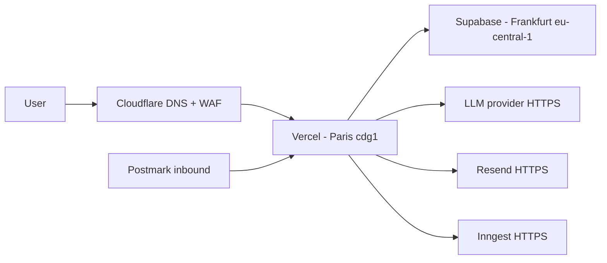

# Hosting and deployment — Prodet Platform

> Status: Draft. Owner: Souhail. Last updated: 2026-05.
> Region selection pending [open question 8](../01-product/open-questions.md).

## Topology

## Environments

| Environment | Domain (target) | Vercel project | Supabase project | Branch | Notes |
|---|---|---|---|---|---|
| **Production** | `prodet.tn` (TBD per Q1) | `prodet-platform` | `prodet-prod` | `main` | Auto-deploy on push to `main`. |
| **Staging** | `staging.prodet.tn` (or Vercel-issued) | `prodet-platform-staging` | `prodet-staging` | `staging` | Manual promote from preview. Used for end-to-end validation, especially Swiver-import scripts. |
| **Preview** | per-PR Vercel URL | (preview deployments under prod project) | `prodet-staging` (shared) | feature branches | One preview per PR. Shares the staging DB. |
| **Local** | `localhost:3000` | n/a | local Postgres (Docker) or `supabase start` | feature branches | `.env.local` with dev values. |

**Why staging shares the DB with previews.** Per-PR DB branching is a paid Supabase feature; defer until Phase 2 if needed. PR previews are read-mostly; mutations are confined to short-lived test data.

## Region

- **Primary recommendation**: Vercel `cdg1` (Paris) + Supabase `eu-central-1` (Frankfurt). Closest EU compute to Tunisia, mature regions, low latency.
- Alternatives evaluated:
  - Vercel `fra1` (Frankfurt) — equivalent.
  - Supabase `eu-west-3` (Paris) — also fine; pick whichever pairs with the Vercel region for sub-region latency.
- **MENA-resident hosting** would require leaving Vercel/Supabase. Not justified at MVP unless [open question 8](../01-product/open-questions.md) reveals a hard requirement.

## DNS

- **Cloudflare** is the DNS authority. Registrar may differ.
- A/CNAME records pointing the apex and `www` to Vercel.
- `MX` records for Postmark inbound (`orders@`) once provisioned.
- `TXT` records for SPF, DKIM (Resend + Postmark), DMARC.
- `CAA` records restricting issuance to Let's Encrypt + Cloudflare.

## TLS

- TLS terminated at both Cloudflare and Vercel.
- HSTS with `max-age=31536000`, `includeSubDomains`, `preload` once we are confident in the rollout (defer `preload` until 1 month post-launch).
- TLS 1.2 minimum.

## Secrets management

- **Vercel project env vars** for runtime secrets, separated by environment (`production`, `preview`, `development`).
- **Supabase Vault** for per-row encryption needs (deferred — no use case at MVP).
- **`.env.example`** committed; `.env.local` gitignored.
- Rotation cadence: documented in [security-rgpd.md](security-rgpd.md). Annual minimum; on-incident immediate.

## Build and deploy

- `pnpm build` runs on Vercel.
- Drizzle migrations run **before** the build via a Vercel build command override or a pre-build script. If a migration fails, the deploy fails.
- Build cache leveraged.
- Bundle analyzer in CI on `main` builds (no enforcement, only reports).

## Database operations

- **Migrations** — forward-only SQL via Drizzle Kit. Generated locally, reviewed in PR, applied automatically on deploy.
- **Seed** — `pnpm db:seed` for local dev only. Production seeded once via a script run by Souhail with `owner` credentials.
- **Backups** — Supabase daily backup retained 7 days at MVP; PITR added at Phase 2 (paid tier).
- **Restore drill** — performed quarterly. Documented in [../05-ops/runbooks/](../05-ops/runbooks/).

## Storage

- Three Supabase Storage buckets: `product-images`, `product-documents`, `order-attachments`.
- `product-images` and `product-documents` are public-read.
- `order-attachments` is private; signed URLs issued on demand by server actions.
- Lifecycle: `order-attachments` retention follows the personal-data policy in [security-rgpd.md](security-rgpd.md).

## Edge / CDN

- Cloudflare in front of Vercel. By default Vercel handles its own CDN — Cloudflare adds DDoS, WAF, optional rules (geo, rate limit), and is the DNS authority.
- Caching: defer to Vercel's ISR for marketing/catalog. Cloudflare passes through dynamic.
- WAF: enable Cloudflare's "B2B / business" managed ruleset; tighten as data emerges.

## Observability stack

| Concern | Tool |
|---|---|
| App errors | Sentry (frontend + serverless) |
| Logs | Logtail (or Vercel Logs at MVP) |
| Uptime | Better Stack monitor (or self-hosted heartbeat) |
| Web analytics | Plausible |
| Custom business events | Postgres `audit_log` + Inngest dashboards |
| Synthetic checks | Playwright smoke tests run from GitHub Actions on cron (Phase 2) |

## CI/CD

- **GitHub Actions**:
  - PR: lint, typecheck, unit tests, drizzle drift check, link check (docs).
  - `main`: same + bundle analyzer.
  - Cron: link check across docs and external links (weekly).
- **Vercel**:
  - PR: preview deploy.
  - `main`: production deploy after CI green.
  - Required checks: tests + drift check + Vercel build.

Branch protection on `main`: 1 reviewer (self-approval allowed for solo work but flagged), required CI checks, no force-push.

## Domain and email setup checklist (one-time)

- [ ] Confirm domain ownership ([Q1](../01-product/open-questions.md)).
- [ ] Move DNS to Cloudflare.
- [ ] Configure Vercel domain.
- [ ] Configure Resend domain (DKIM + SPF + DMARC).
- [ ] Configure Postmark inbound domain (`orders@…` MX).
- [ ] Set HSTS (without preload initially).
- [ ] Add Cloudflare WAF default rules.
- [ ] Enable Cloudflare Turnstile site key (used by quote form).
- [ ] Issue first staging deploy and run smoke tests.

## Cost ceiling (recap)

See [tech-stack.md §Cost ceiling](tech-stack.md#cost-ceiling-at-mvp). Budget envelope to confirm in [open question 11](../01-product/open-questions.md).

## Related

- [system-overview.md](system-overview.md), [tech-stack.md](tech-stack.md), [security-rgpd.md](security-rgpd.md).
- [adr/0003-postgres-supabase.md](adr/0003-postgres-supabase.md), [adr/0010-jobs-and-queues.md](adr/0010-jobs-and-queues.md).
- [../05-ops/](../05-ops/) — CI/CD, deployment, observability, incident response.
