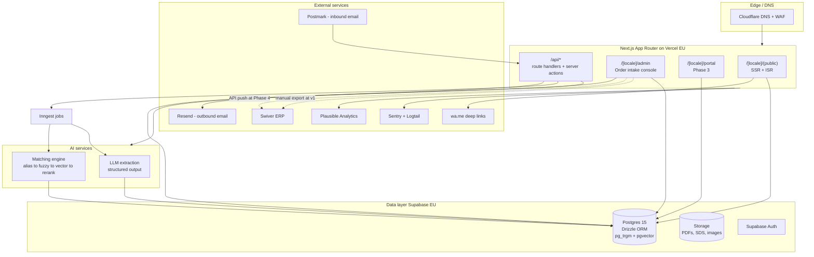
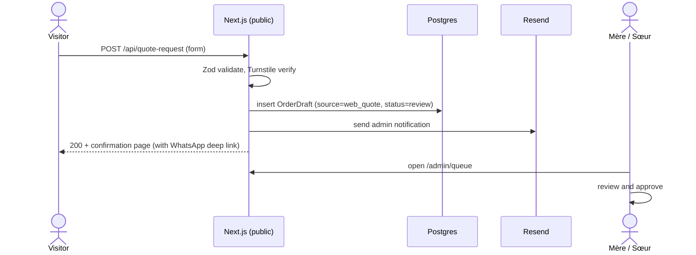
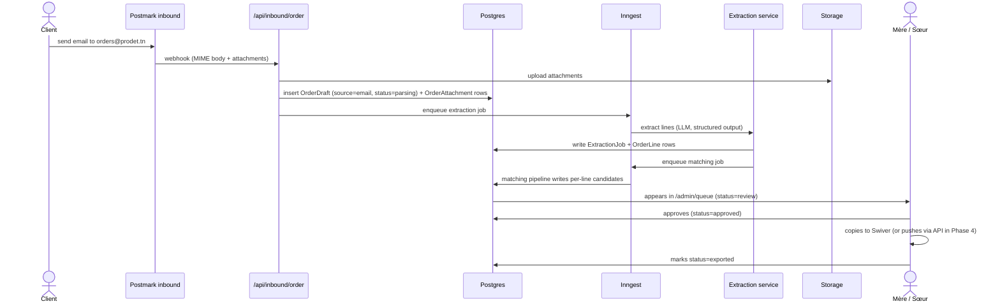
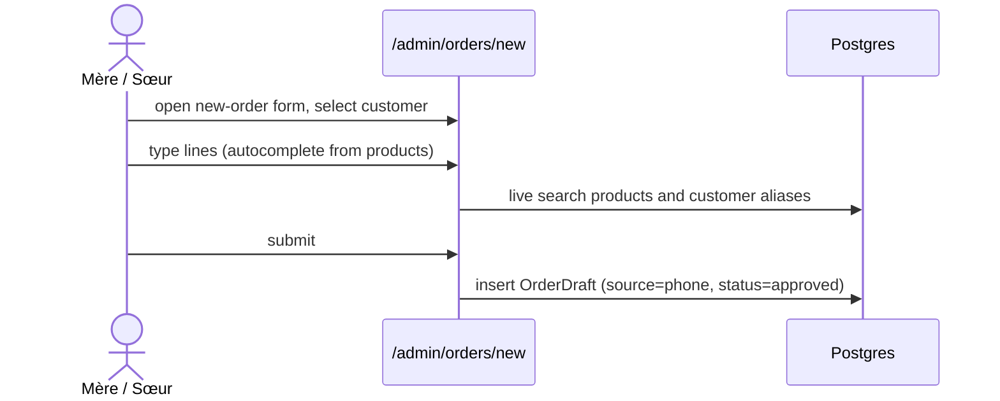

# System overview — Prodet Platform

> Status: Draft. Owner: Souhail. Last updated: 2026-05.
> Companion docs: [tech-stack.md](tech-stack.md), [data-model.md](data-model.md), [auth.md](auth.md), [i18n.md](i18n.md), [hosting.md](hosting.md), [security-rgpd.md](security-rgpd.md), [adr/](adr/).

## Architectural posture

- **One Next.js app, three audiences.** A single Next.js application (App Router) serves the public site, the admin console, and (Phase 3) the client portal — separated by route groups, not by deployment. Solo-dev velocity, shared design system, shared types.
- **Postgres-first.** Postgres holds everything: products, customers, orders, aliases, embeddings (`pgvector`), full-text indexes (`pg_trgm`, FTS). No separate vector DB, no separate search service at MVP.
- **Swiver as ERP source of truth.** Prodet Platform produces drafts and proposals; Swiver records the truth. Push-to-Swiver is manual at v1, automated when [Spike 1](../06-spikes/spike-swiver-api.md) confirms it.
- **AI proposes, humans approve.** Every AI output (extracted lines, matched products, alias proposals) requires a human action before becoming a business artifact.
- **Boring tech bias.** Prefer well-known stable building blocks. Reach for new SaaS only when the existing stack genuinely cannot do the job.

For the per-decision rationale see the relevant ADR under [adr/](adr/).

## High-level diagram

## Component summary

### Web app (Next.js, App Router)

- Single deployment. Three route groups under `[locale]`:
  - `(public)` — homepage, about, sectors, catalog, product detail, quote request, contact, legal.
  - `admin` — auth-gated. Order intake console, customer/product directories, dashboard.
  - `portal` — auth-gated. Phase 3.
- **Rendering strategy.** Public catalog and marketing pages: SSR + ISR (revalidate on demand when products change). Admin/portal: dynamic, SSR with auth check.
- **Server actions** for mutations originating from the UI; **route handlers** under `/api/*` for webhooks and external integrations (Postmark inbound, future Swiver, future WhatsApp).
- **No client-side data fetching libraries** (SWR/React Query) at MVP — server actions cover the use case. Re-evaluate at Phase 3 portal if interactivity demands it.

### Database (Postgres via Supabase, EU)

- Postgres 15 with extensions: `pg_trgm`, `pgvector`, `unaccent`, `uuid-ossp` (or pgcrypto for `gen_random_uuid`).
- Schema managed by Drizzle. Migrations in `drizzle/migrations/` checked into the repo.
- **Row-level security.**
  - MVP: RLS *enabled* on all tables; admin role bypasses via service-role key from server actions. No customer access yet.
  - Phase 3: customer-scoped policies on `customer_*` tables.
- Daily encrypted backup (Supabase managed).
- Point-in-time recovery considered at Phase 2 (paid Supabase tier).

### Storage (Supabase Storage)

- Buckets:
  - `product-images` — public read, admin write.
  - `product-documents` — public read (SDS, TDS), admin write.
  - `order-attachments` — admin read/write only. Inbound-email PDFs land here.
- Signed URLs for `order-attachments`.

### Authentication (Supabase Auth)

- MVP: email + password (or magic link) for ~4 admin accounts.
- Phase 3: customer self-signup with admin-approval workflow.
- Session via Supabase JWT in HTTP-only cookies.
- Detail in [auth.md](auth.md).

### AI services

- **Extraction.** Server-side call to LLM provider (Claude or GPT) with Zod-validated structured output. Recorded in `extraction_jobs`.
- **Matching.** In-process pipeline:
  1. **Alias hit.** Direct lookup against `product_aliases` (customer-scoped first if customer known, then global).
  2. **Exact code match.** If the input contains a token matching a product `code`/`sku`.
  3. **Trigram fuzzy.** `pg_trgm` similarity against `products.search_text` (lowercased + unaccent).
  4. **Embedding cosine.** `pgvector` cosine distance against per-product embedding.
  5. **LLM rerank.** Top-K candidates from steps 3–4 reranked by an LLM with the raw input as context.
- Both are stateless; logs land in Postgres for analysis.
- Detail per module: [../03-modules/product-matching/](../03-modules/product-matching/), spike: [../06-spikes/spike-product-matching.md](../06-spikes/spike-product-matching.md).

### Background jobs (Inngest)

- Use cases at MVP:
  - Inbound email pipeline (Postmark webhook → enqueue extraction job → notify admin).
  - Re-embedding when product names/descriptions change.
  - Daily Swiver export sync (if API allows).
- Inngest free tier covers MVP traffic. Self-hosted considered if cost or data-residency demands.

### Email (Resend outbound, Postmark inbound)

- **Outbound** (Resend). Quote-request acknowledgements, admin notifications, future portal transactional.
- **Inbound** (Postmark). `orders@prodet.tn` → Postmark inbound webhook → `/api/inbound/order` route handler → parses MIME, stores attachments in Storage, creates `OrderDraft` with `source = 'email'`.
- Why two providers: Resend's inbound is limited; Postmark's is mature. Could be consolidated to Postmark-only if cost matters.

### Edge / DNS (Cloudflare)

- Cloudflare in front of Vercel: DNS, WAF, DDoS, optional caching of public assets, room for future Workers (e.g. geo-redirect, custom rate limiting).
- TLS terminated at Cloudflare and Vercel both.

### Observability

- **Errors** — Sentry (frontend + backend).
- **Logs** — Logtail (or Vercel Logs at MVP if Logtail not yet configured).
- **Analytics** — Plausible (no cookie banner needed).
- **Custom events** — written to `audit_log` table for business events (extraction, match override, push-to-Swiver). Eventually piped to Logtail for retention.

### External integrations

- **Swiver** — out-of-band CSV import at MVP; API integration in Phase 4 ([Spike 1](../06-spikes/spike-swiver-api.md)).
- **WhatsApp** — `wa.me/<E.164>` deep links at MVP. Phase 4 may upgrade to WhatsApp Business API.

## Request flows

### Public quote request

### Inbound email order

### Manual phone-order entry

## Deployment topology

- **Production.** Vercel (`cdg1` Paris) + Supabase (`eu-central-1` Frankfurt). Cloudflare DNS in front. Region pending [open question 8](../01-product/open-questions.md).
- **Preview.** Vercel preview deploys per PR. Supabase **preview branch** per PR (paid feature — defer to Phase 2 if needed; until then, preview deploys point at `staging` Supabase project).
- **Staging.** A second Supabase project + Vercel project for pre-production validation, especially of Swiver-export scripts.
- **Local.** Local Postgres via Docker compose; or `supabase start` if developer prefers. Drizzle migrations apply identically.

## Security boundaries (concise)

- Cloudflare → Vercel HTTPS.
- Vercel → Supabase via service-role key (server-side only) for admin paths; via anon key + RLS for public/portal paths.
- LLM provider — outbound HTTPS, secrets in Vercel env. No customer PII in prompts beyond what is required for matching (customer name and product line text).
- Postmark inbound webhook signed (HMAC), verified by route handler.
- Detail in [security-rgpd.md](security-rgpd.md).

## Failure modes and degradation

| Component | Failure | Behavior |
|---|---|---|
| LLM extraction | Provider down / rate-limited | Order draft stays `parsing`, surfaced as such. Admin can switch to manual entry. |
| Matching engine | Embeddings stale or pgvector slow | Fall back to alias + trigram only. Mark candidates with `degraded=true`. |
| Postmark inbound | Webhook fails | Postmark retries (built-in). Admin sees "no new orders" — fallback is the existing email inbox they already monitor. |
| Resend outbound | Provider down | Notifications dropped silently with a Sentry alert. Admin queue still works. |
| Swiver | API down (Phase 4) | Drafts queue locally; manual copy/paste fallback always available. |
| Supabase | Down | Site goes down. Public site may serve stale ISR pages. Acceptable at MVP. |

## Scalability notes (don't over-think)

At MVP traffic (a few hundred catalog views per day, < 30 orders per day), every component is comfortably inside its free or low-tier limits. We will not pre-optimize for scale. Re-evaluate when:

- Public traffic exceeds ~10k/day (CDN caching strategy).
- Order volume exceeds ~200/day (job queue capacity, extraction cost).
- Catalog exceeds ~5k products (search architecture).

## Related ADRs

- [adr/0001-record-format.md](adr/0001-record-format.md) — ADR template.
- [adr/0002-nextjs-app-router.md](adr/0002-nextjs-app-router.md)
- [adr/0003-postgres-supabase.md](adr/0003-postgres-supabase.md)
- [adr/0004-drizzle-vs-prisma.md](adr/0004-drizzle-vs-prisma.md)
- [adr/0005-i18n-strategy.md](adr/0005-i18n-strategy.md)
- [adr/0006-search-strategy.md](adr/0006-search-strategy.md)
- [adr/0007-ai-extraction-architecture.md](adr/0007-ai-extraction-architecture.md)
- [adr/0008-product-matching-engine.md](adr/0008-product-matching-engine.md)
- [adr/0009-swiver-integration-strategy.md](adr/0009-swiver-integration-strategy.md)
- [adr/0010-jobs-and-queues.md](adr/0010-jobs-and-queues.md)
