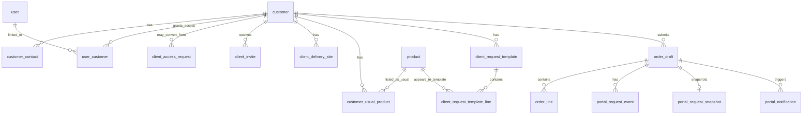
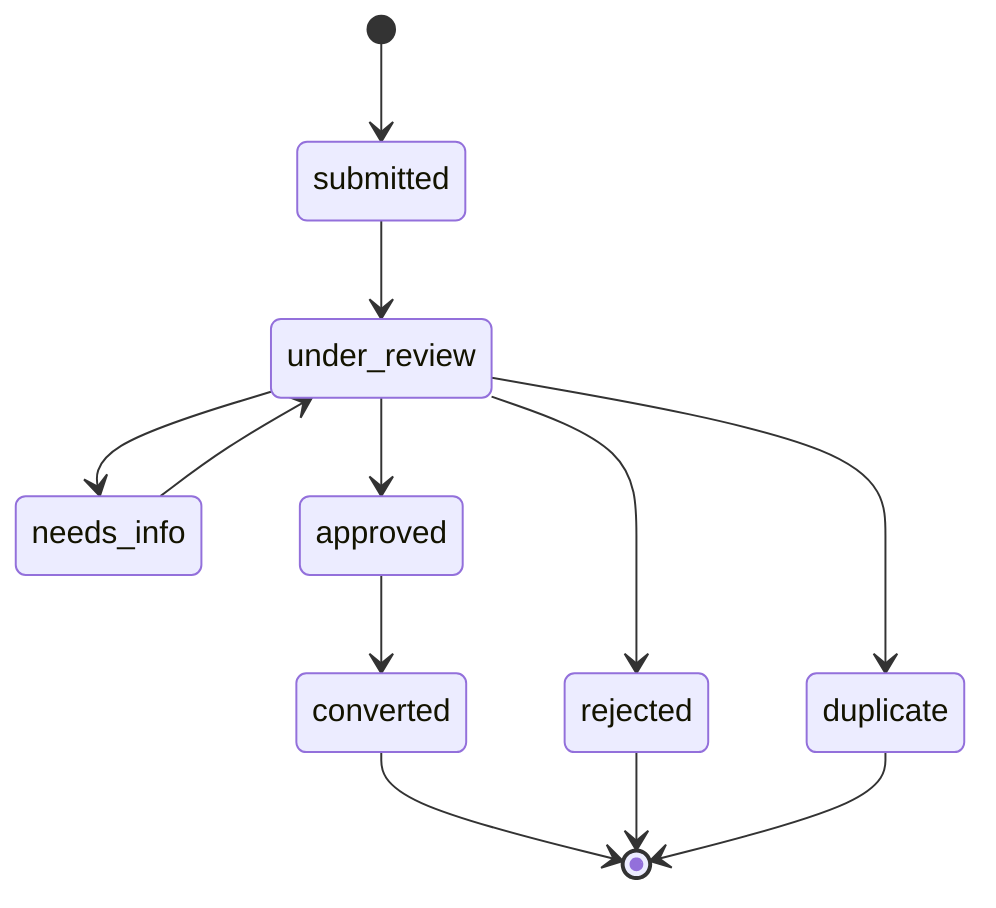
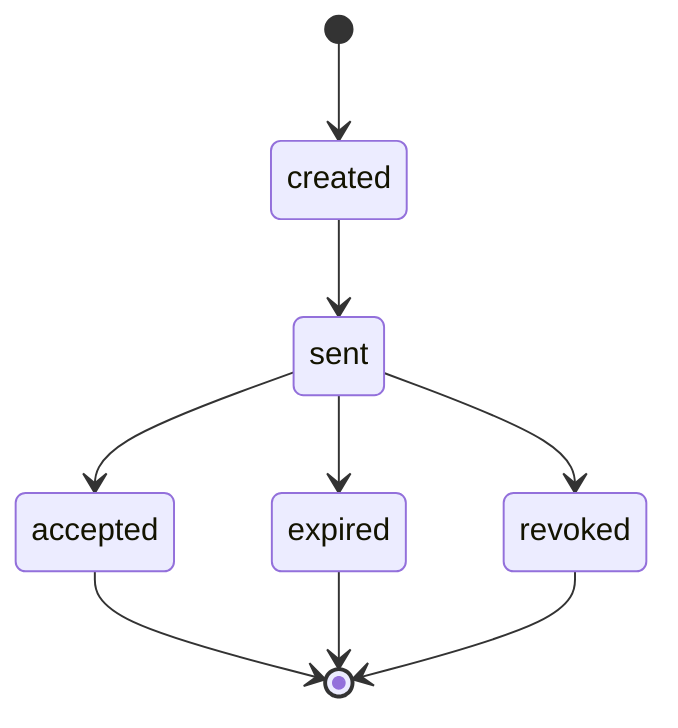

# Client portal data model

> Status: Phase 3 planning proposal. Owner: Souhail. Last updated: 2026-05-15.
> Parent spec: [client-portal.md](client-portal.md). Flows: [client-portal-flows.md](client-portal-flows.md). Architecture baseline: [../02-architecture/data-model.md](../02-architecture/data-model.md).

## Data Model Goals

The portal data model must support:

- validated client access,
- usual products,
- last-request reorder,
- catalog/search add-to-request,
- quantity edits,
- per-product notes,
- delivery site selection,
- request history and status,
- copy/export from a stable submitted snapshot,
- simple stats,
- internal review queue integration,
- future Swiver mapping without automatic official document creation.

It must not require:

- prices,
- stock,
- payment,
- autonomous Swiver writes,
- separate portal database.

## Reuse Existing Tables

The portal should reuse the existing core model where possible:

- `customer`
- `customer_contact`
- `user`
- `user_role`
- `user_customer`
- `product`
- `product_translation`
- `product_asset`
- `category`
- `family`
- `sector`
- `order_draft`
- `order_line`
- `audit_log`

Portal-specific tables should add access, usability, delivery, snapshot, notification, and history behavior without duplicating orders into a separate order system.

## High-Level ERD

## Table: `client_access_request`

Public request to become a validated Prodet portal client.

| Column | Type | Notes |
|---|---|---|
| `id` | uuid pk | Generated server-side. |
| `company_name` | text | Required. |
| `contact_name` | text | Required. |
| `email` | text | Required, normalized lowercase. |
| `phone` | text | Required. |
| `sector_key` | text nullable | Soft reference to sector key. |
| `city` | text nullable | City or delivery zone. |
| `delivery_address` | text nullable | Initial address if known. |
| `existing_customer_hint` | text nullable | Free text: already client, code, contact person. |
| `requested_products` | text nullable | Needs/products. |
| `message` | text nullable | Additional detail. |
| `status` | text | See status model. |
| `converted_customer_id` | uuid nullable | Set if approved/linked. |
| `review_notes` | text nullable | Internal only. |
| `reviewed_by` | uuid nullable | FK to `user`. |
| `reviewed_at` | timestamptz nullable | Review timestamp. |
| `created_at` | timestamptz | Request timestamp. |
| `updated_at` | timestamptz | Trigger-managed. |

Indexes:

- `(status, created_at desc)`
- `lower(email)`
- trigram on normalized `company_name` if duplicates become common.

Status:

- `submitted`
- `under_review`
- `needs_info`
- `approved`
- `rejected`
- `duplicate`
- `converted`

## Table Extensions: `customer`

Existing `customer` remains the organization table. Phase 3 should add:

| Column | Type | Notes |
|---|---|---|
| `portal_status` | text | `disabled`, `invited`, `active`, `suspended`. |
| `portal_enabled_at` | timestamptz nullable | First portal activation. |
| `portal_suspended_at` | timestamptz nullable | Current suspension if any. |
| `validated_by` | uuid nullable | FK to `user`. |
| `validated_at` | timestamptz nullable | Validation timestamp. |
| `default_delivery_site_id` | uuid nullable | FK to `client_delivery_site`. |

Do not store pricing policy in portal fields at MVP.

## Table Extensions: `customer_contact`

Existing contacts can become portal users.

| Column | Type | Notes |
|---|---|---|
| `auth_user_id` | uuid nullable | Supabase Auth user id or local `user.auth_id` reference. |
| `portal_role` | text nullable | `buyer`, `viewer`, `org_admin`. |
| `portal_status` | text nullable | `invited`, `active`, `disabled`. |
| `last_portal_login_at` | timestamptz nullable | Optional. |

If this coupling is awkward in implementation, keep auth linkage only in `user` + `user_customer` and leave `customer_contact` as business contact data.

## Table: `client_invite`

Single-use invitation or access code.

| Column | Type | Notes |
|---|---|---|
| `id` | uuid pk | Generated server-side. |
| `customer_id` | uuid | FK to `customer`. |
| `email` | text | Invite recipient. |
| `code_hash` | text nullable | Never store plain code. |
| `token_hash` | text nullable | For link-based invite. |
| `status` | text | `created`, `sent`, `accepted`, `expired`, `revoked`. |
| `expires_at` | timestamptz | Required. |
| `accepted_at` | timestamptz nullable | Set after activation. |
| `accepted_user_id` | uuid nullable | FK to `user`. |
| `created_by` | uuid | FK to Prodet `user`. |
| `created_at` | timestamptz |  |

Indexes:

- `(customer_id, status)`
- `lower(email)`
- token/code hash unique where not null.

## Table: `client_delivery_site`

Customer delivery locations used by portal requests.

| Column | Type | Notes |
|---|---|---|
| `id` | uuid pk |  |
| `customer_id` | uuid | FK to `customer`. |
| `label` | text | Example: `Hôtel - cuisine`, `Dépôt Charguia`. |
| `address_line1` | text |  |
| `address_line2` | text nullable |  |
| `city` | text nullable |  |
| `postal_code` | text nullable |  |
| `contact_name` | text nullable | Site contact. |
| `phone` | text nullable | Site phone. |
| `delivery_notes` | text nullable | Access notes. |
| `status` | text | `active`, `pending_review`, `archived`. |
| `is_default` | boolean | One default per customer by app constraint. |
| `created_at`, `updated_at` | timestamptz |  |

MVP rule: Prodet manages saved sites. Client-entered new addresses are saved as request notes or `pending_review`.

## Table: `customer_usual_product`

Configured reorder list per customer.

Implemented in Phase 2B as the narrow foundation for portal usual products.

| Column | Type | Notes |
|---|---|---|
| `id` | uuid pk |  |
| `customer_id` | uuid | FK to `customer`. |
| `product_id` | uuid | FK to `product`. |
| `default_quantity` | integer | Defaults to `1`; must be positive. |
| `note` | text nullable | Prodet-managed note for the client. |
| `is_active` | boolean | Hide without deleting. |
| `created_at`, `updated_at` | timestamptz |  |

Unique:

- `(customer_id, product_id)`

No price/stock fields.

Deferred fields such as display order, source, last requested date, and portal request counts should be added only when the corresponding real workflow exists.

## Table: `client_request_template`

Saved repeat list. Can be deferred if usual products and last request are enough for MVP.

| Column | Type | Notes |
|---|---|---|
| `id` | uuid pk |  |
| `customer_id` | uuid | FK to `customer`. |
| `name` | text | Example: `Commande hebdomadaire cuisine`. |
| `description` | text nullable |  |
| `default_delivery_site_id` | uuid nullable | FK to `client_delivery_site`. |
| `status` | text | `active`, `archived`. |
| `created_by_user_id` | uuid nullable | Client or Prodet user. |
| `created_at`, `updated_at` | timestamptz |  |

## Table: `client_request_template_line`

| Column | Type | Notes |
|---|---|---|
| `id` | uuid pk |  |
| `template_id` | uuid | FK to `client_request_template`. |
| `product_id` | uuid | FK to `product`. |
| `position` | integer | Display order. |
| `quantity` | numeric nullable | Default. |
| `unit` | text nullable |  |
| `note` | text nullable |  |

Unique:

- `(template_id, product_id)`

## Reuse: `order_draft`

Portal submissions should use `order_draft`.

Portal-specific expectations:

- `source = 'portal'`
- `customer_id` required,
- `created_by` points to portal user,
- `status = 'review'` after submission,
- `raw_input` contains structured portal metadata only, not duplicated full line payload when avoidable,
- `notes` stores request-level note,
- `swiver_export_status = 'none'` until Prodet review/export.

Recommended additional columns if needed:

| Column | Type | Notes |
|---|---|---|
| `delivery_site_id` | uuid nullable | FK to `client_delivery_site`. |
| `submitted_by_user_id` | uuid nullable | Portal user. Could reuse `created_by`. |
| `client_visible_status` | text nullable | Optional derived/cache; prefer events if possible. |

## Reuse: `order_line`

Portal lines should use `order_line`.

Portal-specific expectations:

- `matched_product_id` set when line comes from catalog/usual/template,
- `raw_text` stores submitted product display name snapshot,
- `qty` required,
- `unit` stored,
- `note` stores line note,
- `candidate_alternatives` usually empty for portal-picked products.

## Table: `portal_request_snapshot`

Stable copy/export payload for a submitted request.

| Column | Type | Notes |
|---|---|---|
| `order_draft_id` | uuid pk | FK to `order_draft`. |
| `customer_snapshot` | jsonb | Name, contact, customer ref safe for client. |
| `delivery_snapshot` | jsonb | Delivery site/address at submit time. |
| `lines_snapshot` | jsonb | Product names, conditionnement, units, qty, notes. |
| `locale` | text | Locale used at submit. |
| `created_at` | timestamptz |  |

Why snapshot:

- copy/export should remain stable,
- product names can change later,
- delivery addresses can be updated later,
- client's own ERP copy should match what they submitted.

No price/stock fields at MVP.

## Table: `portal_request_event`

Customer-visible and internal status timeline.

| Column | Type | Notes |
|---|---|---|
| `id` | uuid pk |  |
| `order_draft_id` | uuid | FK to `order_draft`. |
| `customer_id` | uuid | FK to `customer`. |
| `actor_user_id` | uuid nullable | Client or Prodet user. |
| `actor_type` | text | `client`, `prodet`, `system`. |
| `event_type` | text | See event list. |
| `client_visible` | boolean | Whether client can see event. |
| `message_public` | text nullable | Customer-safe message. |
| `message_internal` | text nullable | Internal note. |
| `metadata` | jsonb | No full PII payload. |
| `created_at` | timestamptz |  |

Event examples:

- `portal_request.submitted`
- `portal_request.viewed_by_prodet`
- `portal_request.needs_info`
- `portal_request.confirmed`
- `portal_request.processing`
- `portal_request.exported_to_swiver`
- `portal_request.cancelled`
- `portal_request.client_note_added`

## Table: `portal_notification`

Tracks outbound notifications.

| Column | Type | Notes |
|---|---|---|
| `id` | uuid pk |  |
| `customer_id` | uuid nullable | FK to `customer`. |
| `order_draft_id` | uuid nullable | FK to `order_draft`. |
| `client_access_request_id` | uuid nullable | FK to `client_access_request`. |
| `recipient_email` | text |  |
| `type` | text | `access_submitted`, `invite`, `request_submitted`, `status_update`. |
| `status` | text | `queued`, `sent`, `failed`, `skipped`. |
| `provider_message_id` | text nullable | Resend/Postmark id. |
| `error_message` | text nullable |  |
| `created_at`, `sent_at` | timestamptz |  |

Payloads should store IDs and render content at send time.

## Optional Table: `portal_saved_draft`

Only add if client-side/local draft persistence is insufficient.

| Column | Type | Notes |
|---|---|---|
| `id` | uuid pk |  |
| `customer_id` | uuid | FK to `customer`. |
| `user_id` | uuid | FK to `user`. |
| `draft_payload` | jsonb | Current builder state. |
| `updated_at` | timestamptz |  |

Default: defer. Keep drafts in browser state until there is evidence clients need cross-device draft persistence.

## Status Models

### `client_access_request.status`

### `client_invite.status`

### Portal Request Internal Status

Use `order_draft.status` where possible:

- `draft` is not persisted as `order_draft` until submit unless saved drafts are added.
- Submitted portal request creates `order_draft.status = 'review'`.
- `approved` means Prodet approved internally.
- `exported` means Prodet recorded/copy-pasted/pushed to Swiver.
- `rejected` means Prodet rejects or cancels the request.

Add portal events to express customer-facing nuance:

- `needs_info`,
- `confirmed`,
- `processing`,
- `client_cancelled`,
- `prodet_message`.

### Customer-Facing Status Mapping

| Customer label | Internal source |
|---|---|
| `Envoyée` | `order_draft.status = review` and no Prodet view event yet |
| `En vérification` | review event exists |
| `Information demandée` | latest visible event is needs_info |
| `Confirmée par Prodet` | `order_draft.status = approved` |
| `En traitement` | approved plus internal processing event |
| `Traitée` | `order_draft.status = exported` |
| `Annulée` | rejected/cancelled event |

## Derived Stats

MVP stats can be computed from `order_draft.source = 'portal'` and `order_line`.

Views/materialized views later:

- `portal_customer_product_stats`
  - `customer_id`
  - `product_id`
  - `request_count`
  - `last_requested_at`
  - `avg_days_between_requests`
- `portal_customer_monthly_stats`
  - `customer_id`
  - `month`
  - `request_count`
  - `line_count`
- `portal_customer_category_stats`
  - `customer_id`
  - `category_id`
  - `request_count`

No spending fields unless pricing is approved and reliable.

## RLS and Authorization

Portal RLS policies must ensure:

- client user sees only rows where `customer_id` is linked through `user_customer`,
- client user can insert portal requests only for linked `customer_id`,
- viewer cannot submit requests,
- buyer can submit requests,
- org admin role is later and still scoped to customer,
- public users can insert `client_access_request` only through a rate-limited server action, not direct anon table access if avoidable,
- Prodet admin/operator actions use server-side service role plus explicit role checks.

Sensitive tables:

- `client_delivery_site`
- `customer_usual_product`
- `client_request_template`
- `order_draft`
- `order_line`
- `portal_request_snapshot`
- `portal_request_event`
- `portal_notification`
- `product_alias` with `scope = customer`

## Audit Logging

Write `audit_log` for:

- access request reviewed,
- customer portal enabled/disabled/suspended,
- invitation created/sent/revoked,
- user linked/unlinked to customer,
- usual product added/removed/changed,
- delivery site added/changed/archived,
- portal request submitted,
- portal request status changed,
- copy/export generated if server-side,
- Swiver export/push recorded.

## Migration Phasing

### Phase M1: Access and Identity

- `client_access_request`
- `client_invite`
- customer portal columns
- `user_customer` role checks

### Phase M2: Reorder Core

- `client_delivery_site`
- `customer_usual_product`
- portal extensions to `order_draft`
- `portal_request_snapshot`
- `portal_request_event`

### Phase M3: Habit Features

- templates,
- notifications table,
- stats views,
- optional saved drafts.

### Phase M4: Swiver Enrichment

- imported history mapping,
- Swiver document references safe for client display,
- API status sync if available.

## Data Model Open Questions

1. Should `customer_contact` link directly to Supabase `auth_user_id`, or should all auth linkage live in `user` and `user_customer`?
2. Should delivery sites be imported from Swiver or managed only in Prodet Platform at first?
3. Do clients need multiple users per customer in MVP?
4. Do clients need saved templates in MVP, or can templates wait?
5. Should submitted request snapshots store localized product names or canonical French names? Default: store both if available.
6. Should copy/export include public product codes? Default: only if codes are approved for customer-facing use.
7. How should client-entered new delivery addresses be validated?
8. Should portal request status be stored as a separate field or derived from `order_draft.status` plus events? Default: derive.
9. Should notifications be recorded for every email in MVP or rely on provider logs? Default: record minimal rows.
10. How long should portal request history remain visible to clients?
