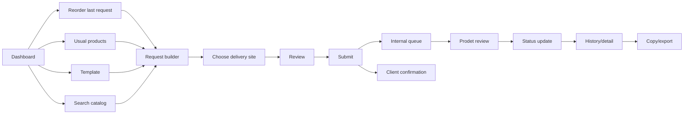
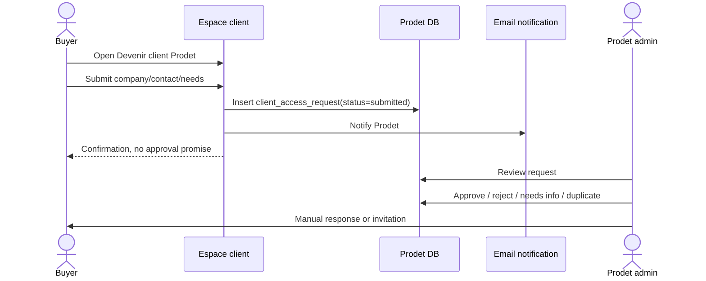
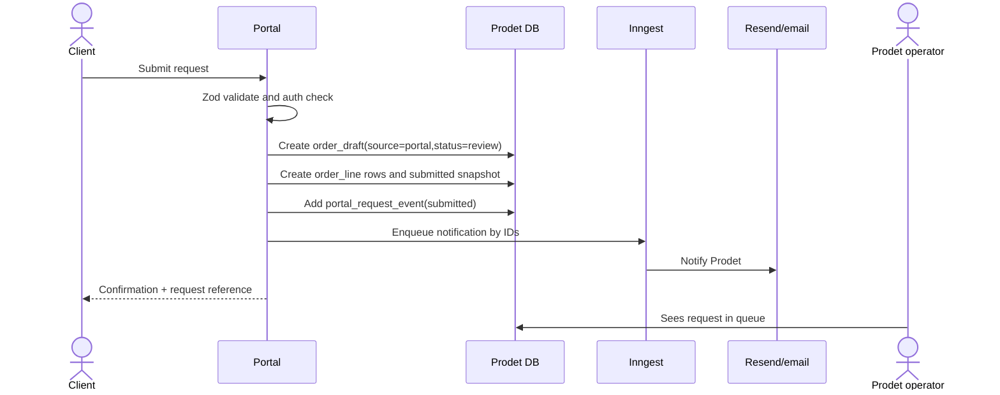

# Client portal flows

> Status: Phase 3 planning proposal. Owner: Souhail. Last updated: 2026-05-15.
> Parent spec: [client-portal.md](client-portal.md). Data model: [client-portal-data-model.md](client-portal-data-model.md). UX brief: [../design/client-portal-ux.md](../design/client-portal-ux.md).

## Flow Principles

- Returning clients should reach a submit-ready request in under 60 seconds.
- The portal starts from memory: last request, usual products, and later templates.
- Browsing the full catalog is a fallback, not the main path.
- Every submitted request remains a request until Prodet reviews it.
- Copy/export features serve the client's own ERP process without becoming checkout.

## Flow Map



## Flow 1: Public Visitor Quote Request

Purpose: let a public buyer request a quote without an account.

1. Visitor browses catalog.
2. Visitor adds public products to devis or writes needs manually.
3. Visitor fills name, company, email, phone, sector, delivery zone, and notes.
4. Site sends the request to `prodet.tunisie@gmail.com`.
5. When the internal bridge exists, the same submission may create `order_draft.source = 'web_quote'`.
6. Visitor sees confirmation that Prodet will respond directly.

Rules:

- no account required,
- no portal history,
- no prices,
- no stock,
- no checkout wording,
- no promise of approval or delivery.

## Flow 2: New Professional Buyer Requests Access

Purpose: collect enough information for Prodet to validate the buyer.



MVP admin outcomes:

- `approved`: create/link customer, send invitation.
- `needs_info`: contact buyer manually.
- `rejected`: mark rejected with internal reason.
- `duplicate`: link to existing customer/contact if appropriate.

## Flow 3: Existing Client Activates Access

Phase 1G implements the controlled foundation for this flow:

1. Prodet approves an access request.
2. Prodet sends a hashed-token invitation.
3. Client confirms the invitation.
4. System creates/links `customer`, `app_user(role = customer_user)`, and `user_customer(role = owner)`.
5. Client requests a Supabase magic link from `/[locale]/connexion-client`.
6. Client lands on `/[locale]/client`, a protected shell only.

The complete dashboard, reorder flow, usual products, history, stats, and Swiver-aware request submission remain future work.

1. Prodet selects existing `customer`.
2. Prodet creates invitation for a contact email or access code.
3. Client opens invitation link or enters access code.
4. Client verifies email and sets password or uses magic link.
5. System creates/links `user`, `user_role.customer_user`, and `user_customer`.
6. Client lands on dashboard.

Failure states:

- expired invitation -> request a new access link,
- unknown email -> request access,
- suspended customer -> contact Prodet,
- unlinked user -> no portal data visible.

## Flow 4: Dashboard

Purpose: make the next action obvious.

Dashboard should show:

- `Recommander la dernière demande`,
- `Produits habituels`,
- current draft if one exists,
- latest request status,
- common delivery site,
- contact Prodet,
- simple stats preview.

60-second target path:

1. Login.
2. Click `Recommander la dernière demande`.
3. Adjust 1-2 quantities.
4. Confirm delivery site.
5. Submit.

## Flow 5: Reorder Last Request

1. Client clicks `Recommander la dernière demande`.
2. System copies the latest eligible submitted portal request into a new draft.
3. Draft lines include product, quantity, unit, conditionnement, and previous notes.
4. Client edits quantities.
5. Client removes lines if not needed.
6. Client adds line notes or request note.
7. Client confirms delivery site.
8. Client submits.

Eligibility:

- latest request belongs to the same `customer_id`,
- request is not cancelled/rejected-only,
- products are still visible/eligible for portal use,
- if a product is retired, show line-level warning and require removal or replacement.

## Flow 6: Reorder from Usual Products

1. Client opens `Produits habituels`.
2. System shows configured usual products grouped by category or product family.
3. Default quantities appear where configured.
4. Client selects products or starts with all default quantities.
5. Client edits quantities.
6. Client adds notes per product.
7. Client submits through the same request builder.

MVP defaults:

- show usual products first,
- no result count,
- no price,
- no stock,
- default quantity can be blank if Prodet has not configured one.

## Flow 7: Create New Request from Catalog/Search

1. Client opens portal search.
2. Search prioritizes usual products, then recent products, then public catalog matches.
3. Client searches by product name, family, code/reference if approved, conditionnement, or common wording.
4. Client clicks `Ajouter`.
5. Product appears in current request builder.
6. Search suggestions close when the client clicks outside or presses Escape.

Search result row:

- image,
- product name,
- conditionnement,
- short use description,
- `Ajouter`.

## Flow 8: Modify Quantities, Items, and Notes

Request builder actions:

- increase/decrease quantity,
- type exact quantity,
- remove product,
- add product by search,
- add line note,
- add request-level note,
- restore last saved quantity if available.

Validation:

- quantity required before submit,
- quantity must be positive,
- unit shown but not editable unless Prodet approves unit alternatives,
- removed products stay out of submitted snapshot,
- line notes are stored with the submitted request.

## Flow 9: Choose Delivery Site / Address

1. Client reaches delivery step.
2. System preselects default delivery site if one exists.
3. Client chooses a saved site or enters a requested new address as a note.
4. If new address is entered, Prodet reviews before treating it as a saved site.
5. Client can add delivery instructions.

MVP delivery model:

- saved delivery sites are configured by Prodet,
- client can request a new site,
- client cannot silently modify official customer addresses.

## Flow 10: Submit Request



Rules:

- submission is idempotent where possible,
- double-click submit should not create duplicate requests,
- request reference is generated server-side,
- submitted snapshot is immutable except internal status/events.

## Flow 11: Prodet Reviews Portal Request

1. Prodet opens internal queue.
2. Request is marked `source = portal`.
3. Prodet sees customer, contact, delivery site, lines, quantities, and notes.
4. Product mapping is already known when the line came from a product ID.
5. Prodet can correct product mapping if needed.
6. Prodet contacts client if information is missing.
7. Prodet approves, rejects, or marks needs info.
8. Later, Prodet manually copies/pushes to Swiver after human approval.

No customer-facing UI should say a request is accepted until Prodet sets an appropriate status.

## Flow 12: View History

Client opens `Historique`.

List columns:

- reference,
- date,
- delivery site,
- status,
- line count,
- top products summary,
- action `Voir`.

Filters:

- status,
- date range,
- delivery site,
- product search.

MVP history includes portal requests only. Swiver-imported history is later unless integration is proven.

## Flow 13: View Request Detail and Status

Request detail shows:

- reference,
- submitted date,
- status,
- delivery site,
- requested lines,
- quantities,
- units,
- line notes,
- request note,
- status timeline,
- Prodet contact action,
- copy/export actions.

Customer-safe status labels:

- `Envoyée`
- `En vérification`
- `Information demandée`
- `Confirmée par Prodet`
- `En traitement`
- `Traitée`
- `Annulée`

## Flow 14: Copy Request to Clipboard

Purpose: help the client paste the request into their own ERP, email, or internal approval document.

Plain text format:

```text
Demande Prodet {reference}
Client: {customer_name}
Date: {submitted_date}
Site de livraison: {delivery_site}

Produits:
1. {product_name} - {conditionnement} - Qté: {qty} {unit}
   Note: {line_note}
2. ...

Message:
{request_note}
```

Rules:

- no prices,
- no stock,
- no Swiver internals unless Prodet approves a customer-safe reference,
- copy from submitted snapshot, not live mutable product data only.

## Flow 15: Export CSV/PDF Later

CSV export:

- reference,
- submitted date,
- customer name,
- delivery site,
- product code if customer-safe,
- product name,
- conditionnement,
- quantity,
- unit,
- line note.

PDF export:

- Prodet branded request summary,
- clearly labeled as `Demande envoyée à Prodet`,
- no invoice/devis numbering unless generated by Swiver and approved for display,
- no price unless later approved.

## Flow 16: View Simple Stats

Stats sources:

- portal requests in Prodet DB,
- later Swiver imported history if reliable.

MVP widgets:

- top products,
- requests per month,
- most used categories,
- reorder frequency,
- last requested dates.

Deferred:

- spending,
- price trends,
- stock reminders,
- delivery performance metrics.

## Notification Flow

MVP notifications:

| Event | Recipient | Channel | Notes |
|---|---|---|---|
| Access request submitted | Prodet | Email | Include request ID, company, contact. |
| Access approved/invite created | Client | Email | Activation link or instructions. |
| Portal request submitted | Prodet | Email + internal queue | Include request reference and customer. |
| Portal request submitted | Client | Email optional | Confirm receipt, no approval promise. |
| Needs information | Client | Manual email first | Structured later. |
| Status changed | Client | Later email | Optional Phase 3.1. |

Use IDs in background job payloads. Fetch full content server-side.

## Error and Empty States

No usual products:

> Aucun produit habituel n'est encore configuré. Contactez Prodet pour préparer votre liste.

No previous request:

> Aucune demande précédente. Commencez depuis vos produits habituels ou recherchez un produit.

No delivery site:

> Aucun site de livraison enregistré. Indiquez l'adresse souhaitée dans la demande.

Submit failure:

> La demande n'a pas pu être envoyée. Vos lignes sont conservées. Réessayez ou contactez Prodet.

Suspended access:

> Votre accès client est suspendu. Contactez Prodet pour plus d'informations.

## Flow Acceptance Criteria

- Reorder last request can be submitted in under 60 seconds by a returning client.
- Usual-products reorder works without opening full catalog.
- New product search can add lines without losing current draft.
- Delivery site is selected or captured before submit.
- Submitted request creates one internal queue item.
- Prodet receives a notification.
- Client sees a confirmation and can later find the request in history.
- Copy-to-clipboard produces useful text with no price or stock.
- All customer-visible statuses avoid implying automatic official order creation.
