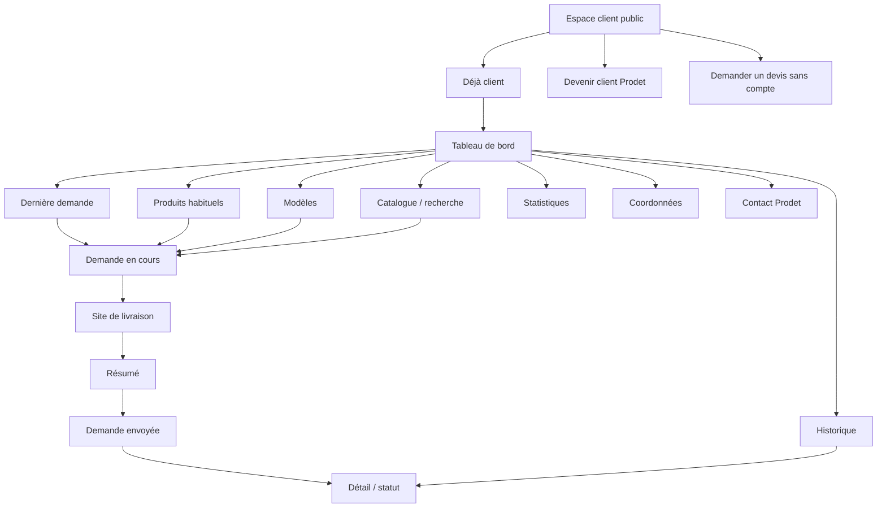

# Module - Client portal

> Status: Phase 3 planning proposal. Owner: Souhail. Last updated: 2026-05-15.
> Companion docs: [client-portal-flows.md](client-portal-flows.md), [client-portal-data-model.md](client-portal-data-model.md), [../design/client-portal-ux.md](../design/client-portal-ux.md), [../02-architecture/adr/0011-client-portal-access-and-request-model.md](../02-architecture/adr/0011-client-portal-access-and-request-model.md).

## Product Vision

The Prodet client portal is a restricted B2B reorder and quote-request system for validated professional clients.

Its job is to make repeat buying from Prodet faster than calling, emailing, or recreating a request in a client's ERP. A returning hotel, restaurant, company, cleaning company, revendeur, or institution should be able to log in, start from usual products or the last request, adjust quantities, choose a delivery site, add notes, and submit in under 60 seconds.

The portal is not an e-commerce shop:

- no public prices,
- no public stock,
- no checkout,
- no online payment,
- no uncontrolled account creation,
- no autonomous official Swiver document creation.

The habit we want to create:

1. The client returns because the portal remembers their products.
2. The client trusts the portal because every request has history and status.
3. The client can still work in their own process because requests can be copied, and later exported.
4. Prodet keeps control because every submitted request lands in the internal review queue.

## Strategic Rules

- Public visitors can browse the public catalog without prices and send a public quote request.
- Public quote requests are email-first to `prodet.tunisie@gmail.com`. When the internal quote bridge is active, they may also create `order_draft.source = 'web_quote'`, but they remain unauthenticated public requests.
- Existing validated clients access `Espace client` by invitation, magic link, password flow, or one-time access code issued by Prodet.
- New professional buyers use `Devenir client Prodet` to request access. Prodet validates before creating or inviting the account.
- Authenticated portal requests are stored in the Prodet database/internal queue with `source = 'portal'`.
- Prodet is notified when a portal request is submitted.
- Swiver integration is prepared through stable customer/product IDs, but no request becomes an official Swiver document without human review.
- AI may suggest product mapping or aliases in the internal console. Humans approve. Swiver records.

## User Roles

| Role | Description | Primary goal | Access |
|---|---|---|---|
| Public visitor | Professional buyer without a portal account. | Browse, select products, request a quote. | Public catalog and public devis only |
| New professional buyer | Company requesting client access. | Become a validated Prodet client or get portal access. | Access request only |
| Pending applicant | Submitted `Devenir client Prodet`. | Wait for validation or provide missing info. | No portal data |
| Validated client buyer | Recurring buyer attached to a Prodet customer organization. | Reorder usual products quickly. | Portal read/write inside own customer scope |
| Validated client viewer | Buyer-side user who can view history but not submit. | Follow status and copy/export request records. | Portal read-only inside own customer scope |
| Client organization admin | Later role for managing buyer-side users. | Invite coworkers and manage delivery/contact info requests. | Later phase |
| Prodet operator | Mère / Sœur reviewing requests. | Validate, correct, contact client, prepare Swiver entry. | Internal admin |
| Prodet admin | Souhail / Père managing access and policy. | Approve access, suspend accounts, configure portal data. | Internal admin |

## Access Model

### Phase 1G Implementation

Phase 1G implements only the controlled activation foundation, not the full portal dashboard.

Current flow:

1. A buyer submits `Devenir client Prodet`.
2. Prodet approves the request in the admin queue.
3. Prodet sends a secure portal invitation.
4. The invitation stores only a token hash and expires after seven days.
5. The invitee opens `/[locale]/activation-client?token=...`.
6. On confirmation, the system creates or links:
   - a local `customer`,
   - an `app_user` with role `customer_user`,
   - a `user_customer` relation with role `owner`.
7. The client requests a magic link at `/[locale]/connexion-client` using the invited email.
8. `/[locale]/client` is accessible only after Supabase session plus `user_customer` validation.

Phase 1G deliberately does not create open registration, passwords, Swiver customers, Swiver documents, reorder flows, product history, usual products, prices, stock, or order submission logic.

### Phase 2A Implementation

Phase 2A adds the authenticated client portal dashboard layout at `/[locale]/client`.

Current behavior:

- server-side access still requires Supabase session plus `user_customer` link,
- the dashboard shows only real linked customer context,
- portal status is shown as activated,
- navigation displays the target portal structure while keeping unfinished sections disabled,
- quick actions communicate the future 60-second reorder path without enabling reorder logic,
- Prodet contact information is shown from the existing company data,
- no fake orders, fake statistics, fake products, prices, stock, Swiver data, or order submission flows are displayed.

### Phase 2B Implementation

Phase 2B adds the first real `Produits habituels` foundation.

Current behavior:

- `customer_usual_product` stores the customer-scoped product list for future reorder flows,
- `/[locale]/client/produits-habituels` is protected by the existing client portal guard,
- product data is fetched server-side and filtered by the authenticated customer's `user_customer` link,
- the dashboard links to the usual-products page and shows a real configured count when rows exist,
- the usual-products page shows product name, category when available, format/unit when available, default quantity, and Prodet note,
- empty state copy explains that Prodet will configure usual products after first requests,
- the future action `Préparer une demande avec ces produits` is visible but disabled,
- no reorder, request submission, fake products, prices, stock, stats, order history, or Swiver integration is implemented.

Admin assignment is intentionally not implemented in Phase 2B. A future admin workflow should let Prodet search validated catalog products and assign them to a customer without exposing prices or stock.

### Phase 2C Implementation

Phase 2C adds the protected client request builder at `/[locale]/client/nouvelle-demande`.

Current behavior:

- access still requires Supabase session plus `user_customer` validation,
- `Nouvelle demande` and `Recommander rapidement` on the dashboard open the request builder,
- clients can start from active `customer_usual_product` rows assigned to their customer,
- clients can search real product records and add them to the request selection,
- clients can adjust quantities, remove products, and add line-level notes,
- clients can add a delivery zone/address text, desired timing, and general message,
- submit creates `order_draft.source = 'portal'`, `order_draft.status = 'review'`, `swiver_export_status = 'none'`, and `order_line` rows,
- `created_by` is the authenticated `app_user`,
- an `audit_log` entry records `portal_request.submitted`,
- viewer memberships cannot submit requests.

Phase 2C deliberately does not create official Swiver documents, invoices, BLs, prices, stock, payment, fake history, fake stats, or automatic ERP push.

Draft saving is deferred. The current `order_status` enum has no `draft` state; adding saved portal drafts should be a deliberate follow-up schema decision rather than overloading `parsing`.

### Phase 2D Implementation

Phase 2D adds the protected request history and detail pages.

Current behavior:

- `/[locale]/client/historique` lists only `order_draft` rows where `customer_id` is the authenticated customer's ID and `source = 'portal'`,
- `/[locale]/client/historique/[id]` returns not found unless the request belongs to the authenticated customer,
- the history list shows reference, created date, client-friendly status, line count, product summary, and delivery/timing context when present,
- the detail page shows request metadata, line items, quantities, units, line notes, and a simple safe timeline,
- `Copier pour mon ERP` copies a text summary with supplier, reference, date, products, quantities, notes, and delivery/message fields,
- dashboard and client navigation now link to history and show a real request count plus last status when available.

Phase 2D deliberately does not add fake delivered orders, fake analytics, prices, stock, payment, checkout, Swiver delivery statuses, or Swiver integration.

### Phase 2E Implementation

Phase 2E adds duplication from a previous portal request into the request builder.

Current behavior:

- history rows show `Reprendre`, linking to `/[locale]/client/nouvelle-demande?from=<order_draft_id>`,
- request detail shows a primary `Reprendre cette demande` action,
- the request builder validates `from` server-side against the authenticated customer's `order_draft` rows,
- only previous requests with `source = 'portal'` and the current `customer_id` can be loaded,
- matched product lines are prefilled with product, quantity, unit, and line note,
- the previous request is not modified and its status is not copied,
- submitting creates a new `order_draft` and new `order_line` rows,
- duplication context is stored in `order_draft.raw_inbound.duplicatedFromOrderDraftId`,
- audit metadata records `duplicatedFromOrderDraftId` and adds `portal_request.submitted_from_previous`.

Phase 2E deliberately does not create official orders, prices, stock, payment, checkout, fake data, or Swiver integration.

### Phase 2F Implementation

Phase 2F adds the protected admin review queue for portal-submitted client requests.

Current behavior:

- `/[locale]/admin/demandes-portail` lists `order_draft` rows where `source = 'portal'`,
- the queue supports search by reference, customer, creator email, and product text,
- the queue supports filtering by the existing `order_status` enum,
- `/[locale]/admin/demandes-portail/[id]` shows customer context, portal metadata, product lines, matched product IDs, raw inbound data, and audit timeline,
- admin status actions can set `review`, `approved`, or `rejected`,
- status changes update `order_draft.updated_at`, set terminal timestamps where applicable, and write `audit_log` action `order_draft.status_updated`,
- client history already reflects these status changes because it reads `order_draft.status`,
- admin navigation now links to both access requests and portal requests.

The existing enum also contains `parsing` and `exported`. Phase 2F displays those values if present, but does not expose them as admin actions. `exported` remains reserved for a later manual Swiver/export phase.

Phase 2F deliberately does not create official orders, devis, invoices, BLs, prices, stock, payment, checkout, fake delivery statuses, or Swiver integration.

### Existing Clients: Invitation-Only

Existing clients do not create uncontrolled accounts. Prodet must first link an account to a `customer` row.

Allowed activation paths:

- Prodet sends an invitation to a known professional email.
- Prodet issues a one-time access code tied to a customer organization.
- Prodet creates a user manually and sends a magic link.

Minimum checks before activation:

- customer exists or is created in the local customer mirror,
- customer is active or approved for portal access,
- user email belongs to an approved contact or has been explicitly approved by Prodet,
- `user_customer` link exists before portal data is visible.

### New Professional Buyers: Request Access

`Devenir client Prodet` is a request, not self-registration.

The form should collect:

- company / establishment name,
- contact name,
- professional email,
- phone,
- sector,
- city / delivery zone,
- delivery address if known,
- products or needs,
- existing Prodet customer status if known,
- message.

Prodet reviews the request and chooses:

- approve and link to an existing customer,
- approve and create a prospect/customer,
- ask for more information,
- reject,
- mark duplicate.

### No Open Registration

The portal must not expose a generic "create account" flow that immediately creates a usable client account. A public user can submit a request, but the account becomes active only after Prodet validation.

## Public Quote vs Portal Request

| Dimension | Public quote request | Authenticated portal request |
|---|---|---|
| User | Any visitor | Validated client user |
| Account required | No | Yes |
| Destination | `prodet.tunisie@gmail.com`; later optional `web_quote` draft | Internal queue/database with `source = 'portal'` |
| Customer identity | Provided by form, not trusted | Trusted link to `customer` through auth |
| Product context | Public catalog selection and free-text needs | Usual products, last requests, templates, catalog/search |
| Delivery address | Free text | Selected delivery site/address, editable as request note |
| History | None for visitor | Full portal request history |
| Copy/export | Not needed | Copy now; CSV/PDF later |
| Prices | No | No in MVP |
| Stock | No | No |
| Payment | No | No |
| Swiver action | None directly | Human-reviewed internal export/push later |

## Information Architecture

## Detailed Screen List

### Public / Access Screens

| Screen | Route | Purpose |
|---|---|---|
| Espace client | `/[locale]/espace-client` or `/[locale]/portal` | Explain restricted access and split `Déjà client`, `Devenir client Prodet`, and public quote path. |
| Déjà client | `/[locale]/portal/connexion` | Login, magic link, password, or access-code activation. |
| Devenir client Prodet | `/[locale]/portal/demande-acces` | Request validation as a professional buyer. |
| Access request confirmation | `/[locale]/portal/demande-acces/confirmation` | Confirm receipt without promising approval. |

### Authenticated Client Screens

| Screen | Purpose | Core actions |
|---|---|---|
| Dashboard | Fast return path for recurring clients. | Reorder last request, open usual products, view latest status. |
| Reorder last request | Duplicate the latest submitted portal request. | Adjust quantities, remove lines, choose delivery site. |
| Usual products | Client-specific product list. | Add default quantities, edit quantities, submit request. |
| Templates | Saved repeat lists, later phase if MVP time allows. | Start from template, edit template later. |
| Catalog/search | Add non-usual products without leaving portal. | Search, filter, add to current request. |
| Request builder | Current draft request. | Modify quantities/items, add product notes, add request note. |
| Delivery site | Choose delivery address/site. | Select saved site, request new site, add delivery note. |
| Review and submit | Confirm lines and destination. | Submit request to Prodet. |
| History | List previous portal requests. | Filter by status/date, open detail, copy/export. |
| Request detail | Read-only submitted request. | View status, copy to clipboard, later export CSV/PDF. |
| Stats | Simple usage summary. | View top products, requests/month, categories, frequency. |
| Company profile | Read-only company and contacts. | Request modification. |
| Contact Prodet | Contextual contact. | Message Prodet about account/request/product. |

### Internal Prodet Screens

| Screen | Purpose |
|---|---|
| Access requests queue | Review `Devenir client Prodet` submissions. |
| Customer portal settings | Enable/suspend portal access for a customer. |
| Customer usual products | Configure products shown in portal. |
| Portal request review | Same internal queue as other `order_draft` sources, with portal context. |
| Portal request detail | Validate lines, map products, contact client, prepare Swiver export. |

## Core Client Workflows

Detailed flow diagrams and edge cases live in [client-portal-flows.md](client-portal-flows.md).

MVP must support:

1. Dashboard.
2. Reorder last request.
3. Reorder from usual products.
4. Create new request from catalog/search.
5. Modify quantities.
6. Add/remove products.
7. Add notes per product.
8. Choose delivery site/address.
9. Submit request.
10. View request history.
11. View request detail/status.
12. Copy request to clipboard for client ERP.
13. Export CSV/PDF later.
14. View simple stats.

## Request Builder Rules

Use B2B language:

- `demande`,
- `réapprovisionnement`,
- `recommander`,
- `produits habituels`,
- `site de livraison`,
- `envoyer la demande`.

Avoid:

- `panier`,
- `checkout`,
- `buy now`,
- `payer`,
- `commande confirmée` before Prodet confirms.

Quantity rules:

- quantities must be positive,
- client may submit non-integer quantities only if the product unit supports it,
- default quantity comes from usual product, last request, or template,
- line notes are optional,
- request-level note is optional,
- changing quantity does not imply stock reservation.

## MVP Scope

Phase 3 MVP should include:

- public `Espace client` entry,
- `Déjà client` login/activation,
- `Devenir client Prodet` access request,
- internal access request review,
- Prodet-issued invitation/access code,
- portal dashboard,
- usual products,
- reorder last request,
- create request from portal search/catalog,
- request builder with quantity edits, add/remove products, line notes, and request note,
- delivery site/address selection,
- submit to internal queue with admin notification,
- request history and request detail/status,
- copy request to clipboard,
- basic stats:
  - top products,
  - requests per month,
  - most used categories,
  - reorder frequency,
- read-only company/contact/delivery profile,
- contact Prodet from portal,
- RLS and authorization tests for customer isolation.

MVP may defer:

- saved templates, if usual products and last request already cover the 60-second reorder target,
- CSV export,
- PDF export,
- Swiver-imported full historical orders,
- client organization admin role,
- client-managed coworker invitations.

## Later Phases

### Phase 3.1

- Saved request templates.
- CSV export.
- PDF export.
- More refined stats and usage charts.
- Client-side request duplicate from any historical request.
- Request status email notifications.

### Phase 3.2

- Swiver read-sync for customer-specific history if the API/export supports it.
- Usual-products import from Swiver purchase history.
- Multiple delivery sites with Prodet approval workflow.
- Customer-scoped aliases visible to clients, editable only with Prodet approval.
- Client organization admin role with Prodet-controlled invitation limits.

### Phase 4+

- Swiver API push after Prodet human approval.
- Webhook or scheduled sync of downstream Swiver status if available.
- Spending stats only if pricing data is reliable and explicitly approved.
- Auto-push only if a later ADR approves it after shadow testing and per-customer opt-in.

## Status Model

Detailed status fields live in [client-portal-data-model.md](client-portal-data-model.md).

### Access Request

`submitted` -> `under_review` -> `approved` / `needs_info` / `rejected` / `duplicate` -> `invited` -> `active`

### Portal Request

Customer-facing:

- `Brouillon`
- `Envoyée`
- `En vérification`
- `Confirmée par Prodet`
- `En traitement`
- `Traitée`
- `Annulée`

Internal:

- `draft`
- `submitted`
- `review`
- `needs_client_info`
- `approved`
- `exported`
- `rejected`
- `cancelled`

Only internal statuses should map to `order_draft.status` where possible. Customer-facing labels can be derived from internal status plus events.

## Notification Model

MVP notifications:

- public access request submitted -> notify Prodet by email,
- portal request submitted -> notify Prodet by email and show in internal queue,
- portal request submitted -> send client confirmation email if transactional email is configured,
- Prodet status update -> optional client email in Phase 3.1,
- access approved/invited -> email invitation,
- access rejected/needs info -> manual email first; structured template later.

Notification principles:

- pass IDs through background jobs, not full PII payloads,
- keep Prodet admin notification terse and actionable,
- do not promise delivery time or acceptance,
- do not expose Swiver internals to clients.

## Copy and Export Model

MVP:

- request detail has `Copier la demande`,
- copied text is plain text, structured for pasting into client ERP/email,
- include request reference, date, delivery site, lines, quantities, units, and notes,
- do not include prices or stock.

Later:

- CSV export for ERP upload,
- PDF export for internal procurement paperwork,
- exports generated from submitted request snapshot, not mutable current product names only.

## Simple Stats

MVP stats should be derived from portal requests only unless Swiver history is imported.

Allowed:

- top products by request frequency,
- requests per month,
- most used categories,
- average reorder interval by product,
- last requested date.

Deferred:

- spending,
- price trends,
- savings,
- stock-based reminders,
- customer profitability.

Spending appears only if pricing data is reliable and a later ADR approves exposing it.

## Data Model Draft

The full data-model draft lives in [client-portal-data-model.md](client-portal-data-model.md).

High-level decisions:

- Reuse `customer`, `customer_contact`, `user`, `user_customer`, `order_draft`, and `order_line`.
- Add portal-specific tables for access requests, invitations, usual products, delivery sites, request templates, request events, and notifications.
- Store submitted request snapshots so copy/export remains stable even if product names later change.
- Keep prices and stock out of portal request tables unless explicitly approved later.

## Swiver Integration Assumptions and Open Questions

Assumptions:

- Swiver remains the ERP source of truth for official commercial documents.
- Portal requests map to Swiver customers/products when IDs are known.
- Portal requests land in Prodet review before Swiver export/push.
- The portal can be useful even if Swiver API write is unavailable.

Open questions:

- Does Swiver expose stable customer IDs through API/export?
- Does Swiver expose stable product IDs and references?
- Can we import customer-specific order history?
- Can we import delivery addresses and contact persons?
- Can Swiver create a draft devis without making it official?
- What duplicate-prevention mechanism exists for Swiver writes?
- Can we read downstream statuses such as devis accepted, BC, BL, facture?
- Should portal users ever see a Swiver document reference? Default: only if Prodet records a client-safe reference.
- Should spending be visible later? Default: no until pricing data quality and business policy are approved.

## Security and Auth Considerations

- Supabase Auth for all portal users.
- No active portal access without `user_customer`.
- RLS scopes customer data by `customer_id`.
- Server actions validate every mutation with Zod.
- Public access requests are rate-limited and protected by Turnstile or equivalent.
- Invitations and access codes are single-use, expiring, and stored hashed.
- Portal sessions use HTTP-only Secure SameSite cookies.
- Client users cannot see other customer organizations, contacts, delivery sites, usual products, requests, aliases, stats, or exports.
- Prodet operators bypass RLS only through server-side service-role actions with explicit role checks.
- Every access approval, invitation, suspension, request submit, status change, export generation, and Swiver export is audit-logged.
- Portal request free text may contain personal data; retention follows [../02-architecture/security-rgpd.md](../02-architecture/security-rgpd.md).

## UX Copy Examples

### Espace Client

Title:

> Espace client Prodet

Subtitle:

> Un accès réservé aux clients professionnels validés. Retrouvez vos produits habituels, préparez une demande de réapprovisionnement et suivez vos échanges avec Prodet.

Actions:

- `Déjà client`
- `Devenir client Prodet`
- `Demander un devis sans compte`

### Déjà Client

> Connectez-vous avec l'adresse invitée par Prodet. Si vous avez reçu un code d'accès, utilisez-le pour activer votre espace.

Actions:

- `Accéder à mon espace`
- `Recevoir un lien de connexion`
- `Je n'ai pas encore d'accès`

### Devenir Client Prodet

> Présentez votre entreprise et vos besoins. Prodet vérifie chaque demande avant d'ouvrir l'accès client.

Submit:

> Envoyer la demande d'accès

Success:

> Demande reçue. Prodet vous contactera après vérification.

### Recommander

Title:

> Recommander vos produits

Body:

> Ajustez les quantités, ajoutez vos notes et envoyez la demande à Prodet pour vérification.

Submit:

> Envoyer la demande

Success:

> Demande envoyée. Elle apparaît dans votre historique avec le statut En vérification.

### Copy Request

Button:

> Copier la demande

Success:

> Demande copiée. Vous pouvez la coller dans votre ERP, un email ou un document interne.

## Acceptance Criteria

The portal planning is acceptable when:

- the system clearly separates public quote requests from authenticated portal requests,
- public visitors can still request a quote without an account,
- no uncontrolled registration path exists,
- a validated client can submit a reorder from usual products or last request in under 60 seconds,
- authenticated requests land in the internal queue and notify Prodet,
- request lines support quantity edits, add/remove, and per-line notes,
- delivery site/address is captured before submit,
- request history and detail/status are visible to the client,
- copy-to-clipboard works without exposing prices or stock,
- stats are useful but derived only from reliable data,
- Swiver integration remains human-reviewed,
- RLS/customer isolation is testable,
- all state-changing actions are audit-logged,
- no page uses consumer checkout language.

## Phase 2G Implementation Notes

The authenticated client dashboard now exposes lightweight operational summaries from real portal
data only:

- `order_draft` rows scoped to `source = portal` and the current customer,
- `order_line` rows linked to those scoped drafts,
- active `customer_usual_product` rows for the current customer,
- current linked `customer` and `user_customer` access context.

The dashboard intentionally avoids charts, revenue analytics, price exposure, stock exposure,
payment wording, and Swiver document statuses. Summary cards and cues are limited to counts and
statuses that already exist in Prodet Platform: total portal requests, requests in review,
confirmed requests, refused requests, latest request status, usual-products count, latest five
requests, and a timestamp-based latest-request timeline preview.

## Open Questions for Souhail

1. Should the public URL be `/espace-client` or `/portal` in the final IA?
2. Which existing clients should be the first 5 portal pilot users?
3. Who at Prodet approves access requests day to day: Souhail, Père, Mère, or Sœur?
4. Should portal users be allowed to invite coworkers in MVP, or only Prodet can invite?
5. How many delivery sites do typical clients have?
6. Are client delivery addresses reliable in Swiver today?
7. Should request templates be MVP, or can usual products plus last request cover the first version?
8. What exact text format do clients need for copy-to-clipboard into their ERP?
9. Which CSV columns would make export useful later?
10. Should clients receive automatic email confirmation when a portal request is submitted?
11. Should clients receive status-change emails, or only check status in portal?
12. Should Prodet expose Swiver document references to clients after processing?
13. Is spending visibility ever acceptable for validated clients? Default: no.
14. Should `Devenir client Prodet` require matricule fiscal, RNE, both, or neither at MVP?
15. Can Prodet manually configure usual products for pilot clients before Swiver history import exists?

## Non-Goals

- No public prices.
- No stock display.
- No online payment.
- No open self-registration.
- No autonomous Swiver push.
- No customer-facing AI.
- No generated official documents.
- No public exposure of internal AI, Swiver, or matching mechanics.
